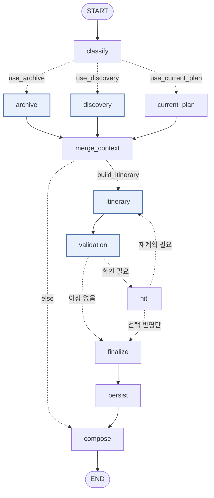

# 문서 2 — Agent Workflow

> **Agent 9종이 LangGraph · LangChain 위에서 어떤 순서로 협업하고, 어떤 데이터가 오가는가.**
> 역할 정의는 [AGENT_ROLES.md](AGENT_ROLES.md), 실행·배포 구조는 [SYSTEM_C4.md](SYSTEM_C4.md).
> 기준 문서는 [PLANNING.md](PLANNING.md) — 특히 §3.1의 «상황별 실행 흐름 CASE 1~4».
>
> **작성 원칙 — 소스가 근거다.** 노드·엣지·리듀서·채널명은 `app/graph/` 에서 확인한 것이다.

---

## 0. 협업 원칙 세 가지

이 세 줄이 워크플로 전체를 결정한다.

| # | 원칙 | 왜 |
|:--:|---|---|
| 1 | **Agent는 서로를 직접 호출하지 않는다** | 호출하면 순서가 코드에 박힌다. 공유 State에 남기면 순서를 바꿔도 계약이 안 깨진다 |
| 2 | **필요한 Agent만 깨운다** | 전체 그래프를 매번 돌리면 지연과 비용이 요청 유형과 무관하게 균일해진다 |
| 3 | **합류는 멱등이어야 한다** | 병렬 갈래가 같은 채널에 쓰므로 단순히 이어 붙이면 합류마다 목록이 불어난다 |

---

## 1. 실행 순서 — 요청 1건의 전체 경로

번호가 실행 순서다. **같은 번호는 동시에 실행된다.**

```
 1  앱 → API              POST /chat (SSE)            ── UI → 인프라
 2  Router(A1)            조건 · 실행 계획 확정        ── 응용
 3  Preference(A2)  ∥  Culture(A3) → Verifier(A4)      ── 응용 (동시 실행)
 4  재료 합류              merge_context                ── 응용
 5  Planner(A5) · Route(A6) · Gap(A7)                   ── 도메인 (+ 인프라 접점)
 6  Guardian(A8)          결함 6종 검사 → triage        ── 응용
 7  확인 필요? ─── 예 ──→ interrupt() 정지 · 사용자 선택
        │                        └── 변경을 골랐으면 → 5 로 되돌아가 재편성 (최대 2회)
        └── 이상 없음 ─┐
 8  확정 → Memory(A9)     수정 행동 기록 · 취향 재집계  ── 응용
 9  응답 구성              근거를 함께 담는다            ── 응용
10  앱 표시                타임라인 · 지도 · 카드        ── UI
────────────────────── 여기까지 1단계 (목표 15초이내) ──────────────────────
11  POST /threads/{id}/routes    실제 경로 좌표 (A6, 자기 예산 목표(15초이내) 이후 2차 지도 좌표 +5초 이내)
12  POST /threads/{id}/verify    공식정보 대조 (A4, 자기 예산 목표(15초이내) 이후 2차 지도 좌표 +5초 이내)
```

**세 지점에서 규칙이 정해져 있다.**

| 지점 | 규칙 |
|---|---|
| 2 → 3 | A1이 확정한 조건을 A2와 A3가 **각자** 읽는다. 둘은 서로를 기다리지 않는다 |
| 5 → 6 | **일정이 완성된 뒤에** 검사한다. 편성 중에 끼면 아직 없는 항목을 검사하게 된다 |
| 7 → 10 | 정지 시점의 상태가 저장돼 있어야 앱을 껐다 켜도 확인 카드가 살아 있다 |

---

## 2. LangGraph 매핑

### 2.1 메인 그래프 — 11 노드



**노드 11개 = 서브그래프 4 + 조율 7.** `build.py` 의 `add_node` 호출 수와 같다.
파란 노드가 서브그래프(실제 로직), 나머지는 조율만 한다.

| 노드 | 담당 Agent | 종류 |
|---|---|---|
| `classify` | A1 Router | 조율 |
| `archive` | A2 Preference | 서브그래프 |
| `discovery` | A3 Culture + A4 Verifier | 서브그래프 |
| `current_plan` | — (기존 일정 로드) | 조율 |
| `merge_context` | — (합류) | 조율 |
| `itinerary` | A5 Planner + A6 Route + A7 Gap | 서브그래프 |
| `validation` | A8 Guardian | 서브그래프 |
| `hitl` | A8 Guardian → 그래프 | 조율 |
| `finalize` | — (선택 반영) | 조율 |
| `persist` | A9 Memory | 조율 |
| `compose` | — (응답 생성) | 조율 |

### 2.2 서브그래프 4개 — 안쪽 흐름

```
archive      plan_facets → ⟨Send⟩ facet_search ×3 → fuse_rerank → extract_relevant
discovery    search_catalog ∥ search_events ∥ search_always_on ∥ search_web
                 → normalize → ⟨조건부⟩ verify → classify
itinerary    ctx_geo ∥ ctx_hours ∥ ctx_weather ∥ ctx_preference
                 → assemble_constraints → schedule
                 → detect_gaps → ⟨Send⟩ nearby_search → rerank_nearby → fill_gaps
validation   ⟨병렬 6종⟩ check_hours · check_travel · check_overlap
                       check_weather · check_revisit · check_friction
                 → triage → build_confirm_cards
```

**규칙 — 서브그래프의 출력은 출력 스키마에 있는 키만 부모로 올라간다.**
제자리에서 고친 값은 돌아오지 않는다. `InMemorySaver` 에서는 같은 객체를 공유해
**우연히** 동작하지만, `PostgresSaver` 는 단계마다 직렬화하므로 통째로 사라진다.
그래서 좌표 확정을 A1으로 옮기고 `DiscoveryOutput` 에 `conditions` 를 명시했다.

---

## 3. 분기 · 병렬 · 정지

세 가지가 이 워크플로를 «필요한 만큼만 돌고, 필요할 때 멈추는» 것으로 만든다.

### 3.1 조건 분기 — 분기 지점 3곳

| 지점 | 함수 | 갈래 |
|---|---|---|
| 팬아웃 | `router.fan_out` | `archive` · `discovery` · `current_plan` |
| 일정을 만들 것인가 | `router.need_itinerary` | `itinerary` · `compose` |
| 확인이 필요한가 | `needs_confirm` | `hitl` · `finalize` |

**라우팅 표 — 요청 유형 7종 × 실행 계획.** `ROUTE_TABLE: dict[RequestType, PlanFlags]`.

| RequestType | archive | discovery | current_plan | itinerary | nearby_fill | 기타 |
|---|:--:|:--:|:--:|:--:|:--:|---|
| `ARCHIVE_QUERY` | ● | | | | | 「작년에 갔던 곳」 — A2 하나만 돌고 끝난다 |
| `PLACE_RECOMMEND` | ● | ● | | ● | | 추천도 일정을 만든다 |
| `PLAN_CREATE` | ● | ● | | ● | ● | 기본 경로 |
| `PLAN_MODIFY` | ● | | ● | ● | | 탐색을 건너뛴다 |
| `REVISIT_PLAN` | ● | ● | | ● | | `freshness_diff` |
| `WEATHER_ADJUST` | ● | ● | ● | ● | | |
| `GAP_FILL` | ● | ● | ● | ● | ● | 현장 대응 |

> **왜 LLM 오케스트레이터가 아닌 정적 테이블인가.** MVP 단계에서 라우팅 규칙은 7행짜리
> 표다. 여기에 LLM을 넣으면 비용·지연·비결정성이 모두 늘고 잘못된 라우팅의 원인 추적이
> 어려워진다. 대신 **교체 지점을 하나로 좁혀 두었다** — Agent가 늘어 규칙이 조합 폭발하는
> 시점에 `router.fan_out()` 함수 하나만 LLM 플래너로 바꾸면 나머지 그래프는 손대지 않는다.

### 3.2 병렬 실행

서로를 기다릴 이유가 없는 것은 같은 단계에 둔다.

| 병렬 지점 | 방식 | 갈래 수 |
|---|---|:--:|
| A2 ∥ A3 | 슈퍼스텝 | 2 |
| 탐색 4소스 | 슈퍼스텝 | 4 |
| 컨텍스트 수집 | 슈퍼스텝 | 4 |
| 검증 6종 | 슈퍼스텝 | 6 |
| facet 검색 | **`Send` 동적 팬아웃** | 3 |
| 후보 검증 | **`Send` 동적 팬아웃** | 실행 시점 결정 (≤12) |
| 주변 검색 | **`Send` 동적 팬아웃** | 빈틈 × 종류 |

**동적 팬아웃은 개수가 실행 시점에 정해진다.** 남은 시간이 모자라면 갈래 수를 줄인다 —
줄여도 결과는 나온다. 팬아웃된 노드는 전체 State를 못 보므로 예산(`deadline`)을
payload에 실어 보낸다.

### 3.3 사람 개입 (HITL)

**AI가 임의로 바꾸지 않는다 — 바꾸기 전에 사용자가 고른다.**

```
validation → needs_confirm ─── 카드 있음 ──→ hitl(interrupt) → 사용자 선택
                            └─ 없음 ────────→ finalize
hitl → after_review ─── 재계획 필요 ──→ itinerary (MAX_REPLAN_ROUNDS = 2)
                     └─ 선택 반영만 ──→ finalize
```

- **규칙 1 — 카드가 실제로 있을 때만 묻는다.** `needs_user_confirm` 만 보고 분기하면 «0/0 선택됨» 인 빈 확인 화면이 뜬다.
- **규칙 2 — `human_review` 는 `async def` 여야 한다.** 동기 노드는 스레드 풀에서 실행되어 runnable config 컨텍스트를 잃고 `interrupt()` 가 동작하지 않는다.
- **규칙 3 — `interrupt()` 페이로드는 JSON 직렬화 가능한 값만.** 전부 `model_dump(mode="json")` 을 거친다.
- **규칙 4 — 사람에게 보일 문장과 기계 계약을 분리한다.** `instruction`(사람이 읽는다)과 `contract`(화면에 안 보인다).

재개는 `Command(resume={"decisions": [...]})` 로 **정확히 그 지점부터**.
정지 시점의 상태는 `PostgresSaver` 체크포인터가 통째로 저장하므로 앱을 껐다 켜도 살아 있다.

---

## 4. 데이터 흐름 — 어떤 출력이 다음 입력이 되는가

Agent는 서로를 호출하지 않는다. **공유 State에 남긴 산출물을 다음 Agent가 읽어 간다.**

| 생산자 | State 채널 | 리듀서 | 소비자 |
|---|---|---|---|
| A1 Router | `request_type` · `flags` | (덮어쓰기) | `fan_out` · `need_itinerary` |
| A1 Router | `conditions` (좌표 확정) | (덮어쓰기) | A2 · A3 · A5 · A7 |
| A2 Preference | `taste_profile` | (덮어쓰기) | A3(점수) · A5(체류시간) |
| A2 Preference | `archive_hits[]` | `MERGE_BY_ID` | A8(`check_friction`) · `compose` |
| A2 Preference | `edit_signals[]` | `MERGE_BY_ID` | A9 |
| A3 Culture | `candidates[]` | `merge_candidates` | A4 · A5 |
| A4 Verifier | `verifications[]` | `MERGE_BY_ID` | A5 · UI 배지 |
| A4 Verifier | `place_diffs[]` | `MERGE_BY_ID` | A8(`check_revisit`) |
| A5·A6·A7 | `itinerary` | (덮어쓰기) | A8 · A9 · UI |
| A7 Gap | `gaps[]` · `nearby[]` | `MERGE_BY_ID` · `merge_candidates` | `fill_gaps` |
| A8 Guardian | `issues[]` · `advisories[]` | **`replace_list`** | `needs_confirm` · UI 카드 |
| 사용자 | `decisions[]` | `MERGE_BY_ADVISORY_ID` | `finalize` · A9 |
| 전 노드 | `evidence[]` | `MERGE_BY_ID` | `compose` · `GET /threads/{id}/evidence/{eid}` |
| 전 노드 | `trace[]` | `append_unique_str` | 진단 |

### 4.0 병렬 합류를 지키는 장치는 **둘**이다 — 키의 종류가 다르기 때문

병렬 갈래가 같은 슈퍼스텝에 같은 키를 쓰면 무슨 일이 나는지는 **그 키에 리듀서가
있느냐**로 완전히 갈린다. 그래서 방어 수단도 둘이고, 서로를 대체하지 않는다.

> **그림** — [병렬 실행 시 키 충돌이 나는 이유 · 출력 스키마로 막는 법](diagrams/parallel-key-conflict.svg)

| | 리듀서가 **있는** 키 | 리듀서가 **없는** 키 (LastValue 채널) |
|---|---|---|
| 예 | `archive_hits` · `candidates` · `evidence` · `trace` | `user_id` · `conditions` · `taste_profile` · `itinerary` |
| 두 갈래가 동시에 쓰면 | 리듀서가 병합한다 — 정상 | **`InvalidUpdateError`** 로 실행이 멈춘다 |
| 지키는 방법 | §4.1 의 리듀서 | **서브그래프 출력 스키마 분리** |

**출력 스키마가 필요한 이유는 두 가지다.** 하나는 §2.2에 적은 «내보내지 않으면
부모로 돌아오지 않는다»이고, 다른 하나가 이것 — **서브그래프를 노드로 붙이면 입력으로
받은 키까지 그대로 반환되어**, `archive` 와 `discovery` 가 동시에 `user_id`·`conditions`
같은 LastValue 채널에 쓰게 된다. 출력 스키마로 부모에 흘려보낼 키를 좁혀 이를 막는다.

```python
StateGraph(ArchiveState,   output_schema=ArchiveOutput)     # app/graph/subgraphs/archive.py
StateGraph(DiscoveryState, output_schema=DiscoveryOutput)   # app/graph/subgraphs/discovery.py
```

병렬로 도는 둘을 대조하면 규칙이 지켜지는 것이 보인다.

```
ArchiveOutput    archive_hits(R) · edit_signals(R) · taste_profile(—) · evidence(R) · trace(R)
DiscoveryOutput  conditions(—)   · candidates(R)   · verifications(R) · place_diffs(R)
                                                    · evidence(R) · trace(R)
```

- 겹치는 키 `evidence` · `trace` → **둘 다 리듀서가 있다** ✅
- 리듀서 없는 키 `taste_profile`(Archive만) · `conditions`(Discovery만) → **겹치지 않는다** ✅
- `user_id` → **양쪽 출력 스키마 어디에도 없다** ✅

> **불변식** — «출력 스키마를 전부 분리한다»가 아니다. 정확히는
> **겹쳐도 되는 키는 반드시 리듀서를 갖고, 리듀서가 없는 키는 한 갈래만 내보낸다.**
> 새 채널을 더할 때 이 두 갈래 중 어디에 속하는지를 먼저 정한다.

### 4.1 리듀서 6종 — 왜 하나로 안 되는가

`operator.add`(이어 붙이기) 하나로 통일하지 않는 이유는 **채널마다 «같은 것»의 정의가
다르기 때문**이다. 무엇을 중복으로 볼지, 겹칠 때 어느 쪽을 남길지가 전부 다르다.

| 리듀서 | 쓰는 채널 | 규칙 | 왜 이것이어야 하나 |
|---|---|---|---|
| `MERGE_BY_ID` | `archive_hits` · `evidence` · `verifications` · `gaps` … | 같은 `id` 는 나중 것으로 갱신 | 병렬 갈래가 같은 채널에 쓴다. 이어 붙이면 합류마다 목록이 불어난다 |
| `MERGE_BY_ADVISORY_ID` | `decisions` | advisory 당 하나만 | 같은 카드에 두 번 답하면 나중 것이 이긴다. 묶는 키가 `id` 가 아니라 `advisory_id` 다 |
| `merge_candidates` | `candidates` · `nearby` | 같은 장소는 **정보가 더 풍부한 쪽**을 남기고 점수는 max | 4소스가 같은 장소를 다른 완성도로 준다 |
| `replace_list` | `issues` · `advisories` | 새 값이 오면 **통째로 교체** (빈 값은 무시) | 검증은 매 라운드 처음부터 다시 본다. 누적하면 **이미 해결된 이슈의 카드가 영원히 남는다** |
| `append_unique_str` | `trace` | 문자열을 순서대로 쌓되 중복은 버린다 | 재계획으로 같은 노드를 두 번 지나도 흔적이 두 줄이 되지 않는다 |
| `merge_dict` | `context` | 얕은 병합 | `ctx_geo` · `ctx_hours` · `ctx_weather` · `ctx_preference` 넷이 같은 dict 에 각자의 칸을 쓴다 |

> `messages` 는 LangGraph 기본 `add_messages` 를 쓴다 — 위 6종은 이 프로젝트가 만든 것이다.

**함정 — `MERGE_BY_ID` 는 모듈 수준 싱글턴이어야 한다.** LangGraph는 같은 채널이 여러
스키마에 나타나면 리듀서의 *함수 객체 동일성*까지 비교한다. 매번 새로 만들면
`Channel already exists with a different type` 으로 그래프 컴파일이 죽는다.

---

## 5. 실행 케이스 — 같은 «수정»이라도 거치는 Agent가 다르다

기획안 §3.1이 정의한 네 가지 상황이다. **무엇을 건너뛰는지가 응답 시간을 가른다.**

| CASE | 발화 | A3 Culture | A4 Verifier | A5·A6·A7 | 라우트 | 결과 |
|---|---|:--:|:--:|:--:|---|---|
| **1 · 신규 생성** | «오늘 오후에 성수에서 놀고 싶어요» | ● 전체 | ● 상위 12 | ● 전체 | `PLAN_CREATE` | 일정 전체 생성 · 근거 누적 |
| **2 · 시간 조정** | «전시를 30분 더 보고 싶어요» | ○ 생략 | ○ 생략(확인 시각 재사용) | ● 재편성만 | `PLAN_MODIFY` | 시간만 조정 · 여유 부족 알림 |
| **3 · 장소 교체** | «마지막 카페를 다른 곳으로» | ◐ 교체 구간만 | ◐ 새 후보만 | ● 해당 구간 | `PLAN_MODIFY` | 구간 교체 · 전/후 비교 |
| **4 · 현장 이벤트** | 전시가 1시간 일찍 끝남 | ● 현재 위치 반경 | ● **캐시 무시** | ● 삽입만 | `GAP_FILL` | 공백 추천 · **거절도 동등 선택지** |

● 전체 · ◐ 부분 · ○ 생략

- **CASE 2가 가장 빠른 이유** — 새 후보가 필요 없어 탐색을 건너뛰고, 확인 시각을 재사용해 검증도 건너뛴다. 편성만 다시 돌면 된다.
- **CASE 4가 캐시를 무시하는 이유** — «지금 영업 중인가»는 캐시된 값으로 답할 수 없다.
- **네 경우 공통** — 변경 전에 사유를 먼저 보여주고 사용자가 고른다. CASE 2~4는 «변경 전 / 변경 후»를 나란히 제시하며, **반영하지 않으면 일정은 그대로다.**

---

## 6. LangChain은 어디에 있는가

LangGraph가 **실행 순서와 상태**를, LangChain이 **모델 호출**을 맡는다.
모델 호출은 전부 `app/llm/provider.py` 한 곳을 지난다.

| 역할 | 쓰는 Agent | 무엇에 | 공급자 | 실패하면 |
|---|---|---|---|---|
| `router` | A1 | 발화 구조화 추출 | `openai:gpt-4o-mini` | 규칙 파서 결과로 진행 |
| `planner` | A3 | 관련성 판정 | `openai:gpt-4o-mini` | 규칙 점수로 진행 |
| `writer` | `compose` · A8 | 일정 서술 · 카드 문구 | NIM `llama-3.1-8b` | 정형 문장으로 폴백 |
| `fast` | A2 · A4 | facet 생성 · 사실 추출 | `openai:gpt-4o-mini` | 규칙 폴백 |
| 임베딩 | A2 | 경험 벡터 (1024차원) | NVIDIA NIM | 아카이브 검색만 꺼짐 |
| 리랭크 | A2 · A7 | cross-encoder 재순위 | NIM `llama-nemotron-rerank-1b-v2` | RRF 결과를 그대로 사용 |

**역할을 나눈 기준은 모델 크기가 아니라 «무슨 일을 시키는가»다.** 같은 모델이라도
평문 생성과 대형 스키마 구조화 출력에서 결과가 정반대로 나온다.
근거와 실측값은 [REQUIREMENTS.md §5.3](REQUIREMENTS.md).

**규칙 — LLM은 «있으면 좋은 것»이지 필수가 아니다.** 전 지점에 규칙 폴백이 있어
모델이 전부 죽어도 일정은 나온다(NFR-04).

---

## 7. 시간 예산 — 왜 2단계로 나눴는가

타임아웃은 «느려서 잘렸다»는 결과만 남기고 무엇을 포기했는지 모른다.
그래서 단계마다 비용을 매기고 `Budget.allows()` 로 **미리** 판단한다.

```python
total_budget_s      = 15.0   # NFR-01
COST_VERIFY_BATCH   = 2.5
COST_TRAVEL_MATRIX  = 3.0
COST_LEG_MEASURE    = 0.4
COST_COMPOSE        = 2.5    # 예약분 — 이건 포기할 수 없다
```

`reserve=COST_COMPOSE` 가 기본값이라 **무엇을 건너뛰든 답변 생성 몫은 항상 남는다**(NFR-02).
건너뛴 단계는 `log_skip(stage, budget, reason)` 으로 흔적을 남긴다.

**그래서 무거운 두 가지를 첫 응답에서 떼어냈다.**

| 단계 | 무엇 | 예산 | 실패하면 |
|:--:|---|---|---|
| 1 | `POST /chat` — 탐색·편성·검증 판정·응답 | 15초 | — |
| 2 | `POST /threads/{id}/routes` — A6 구간 실측 | 자기 예산 60초 | 선이 직선으로 남을 뿐 일정은 이미 손에 있다 |
| 2 | `POST /threads/{id}/verify` — A4 공식정보 대조 | 자기 예산 60초 | 전부 «확인 필요»로 남는다 |

**규칙 — 사용자를 기다리게 하지 않는다.** 2단계는 화면이 이미 그려진 뒤에 돈다.
실패하면 조용히 넘어간다.

**규칙 — 실측 뒤에는 `_reflow()` 를 다시 돌린다.** 재기만 하고 시각을 두면
화면의 도착 시각과 구간 시간이 서로 어긋난 채 남는다.

**규칙 — 늦게 온 응답이 새 일정을 덮지 않게 한다.** 사용자가 그 사이 다시 물었다면
옛 일정의 경로는 버린다(`itinerary.id` 대조).

---

## 8. 실패 격리 — 무엇이 죽으면 무엇이 꺼지는가

**한 Agent의 실패가 워크플로를 멈추지 않는다.** 이것이 9종으로 나눈 이유의 회수 지점이다.

| 죽는 것 | 꺼지는 것 | 그래도 나오는 것 |
|---|---|---|
| A2 Preference | 개인화 점수 · 과거 경고 | 일정 · 지도 · 검증 |
| A3 Culture (외부 API) | 외부 후보 | 내장 카탈로그로 편성 |
| A4 Verifier | 공식정보 배지 | 전부 «확인 필요»로 표시된 일정 |
| A6 Route (경로 API) | 실측 이동시간 · 경로 선형 | «(추정)» 표시된 일정 · 직선 지도 |
| A7 Gap | 식사·카페 채우기 | 빈틈이 빈 일정 |
| A8 Guardian | 확인 카드 | 확정된 일정 |
| A9 Memory (DB 쓰기) | 학습 | 정상 응답 |
| LLM 전부 | 자연스러운 서술 | 규칙 폴백 + 시간순 텍스트 |

| 실패 | 대응 |
|---|---|
| 외부 API | `safe_call(deadline=)` → 기본값, 그래프 계속 |
| LLM 구조화 출력 | 전 지점 규칙 폴백 |
| 임베딩·리랭커 | 조용히 비우되 **로그는 남긴다** |
| DB 연결 | 커넥션 풀 + 체크아웃 시 검사 → 자가 복구 |
| 체크포인터 | Postgres 실패 시 `InMemorySaver` 폴백(경고 로그) |

---

## 9. 이 문서를 고칠 때

1. **노드를 더하거나 빼면 `tests/test_docs_contract.py` 가 먼저 깨진다.** 그 테스트는 노드 **집합**과 `set(ROUTE_TABLE) == set(RequestType)` 을 본다. 숫자 문장은 읽지 않으므로 §2의 «11 노드»는 사람이 지킨다 — `build.py` 의 `add_node` 를 직접 센다.
2. **§4의 채널·리듀서를 바꾸면 [AGENT_ROLES.md §2](AGENT_ROLES.md)의 출력 칸이 함께 바뀐다.**
3. **§5의 CASE는 기획안 §3.1이 원본이다.** 기획안이 바뀌지 않았다면 이 표의 왼쪽 세 칸은 고치지 않는다.
