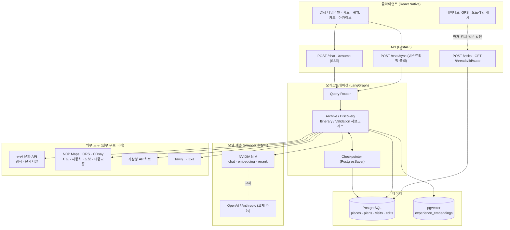
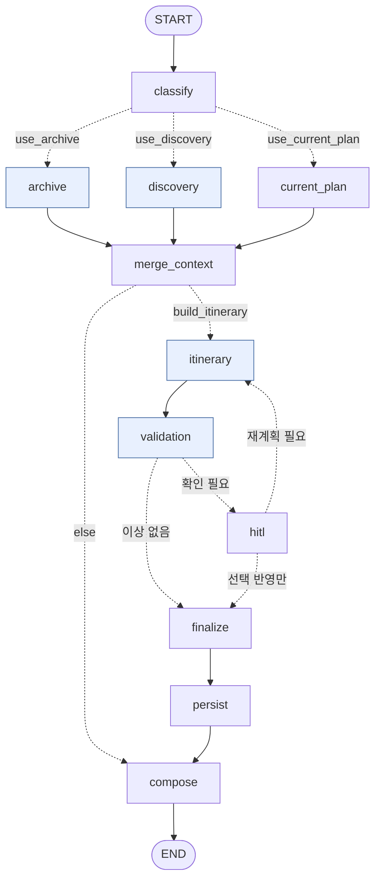
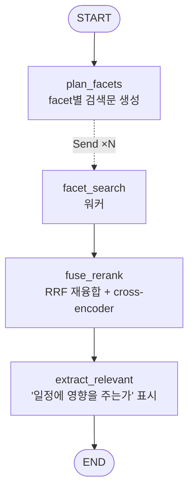
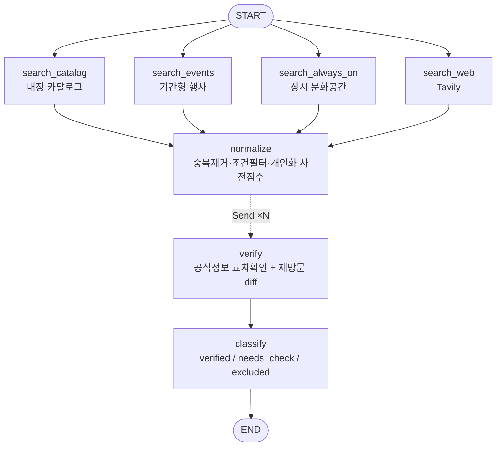
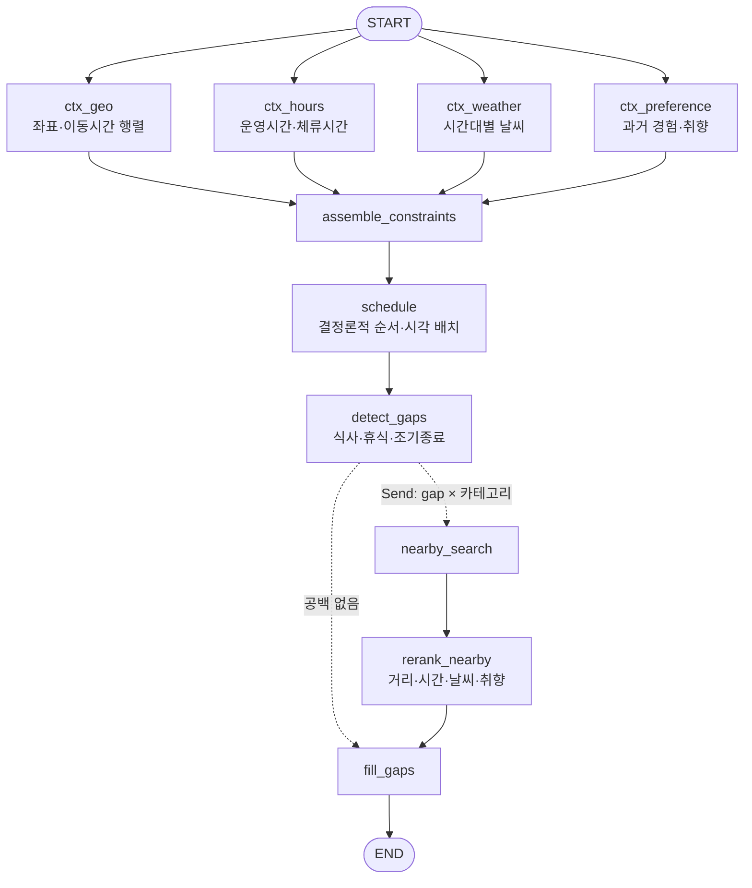
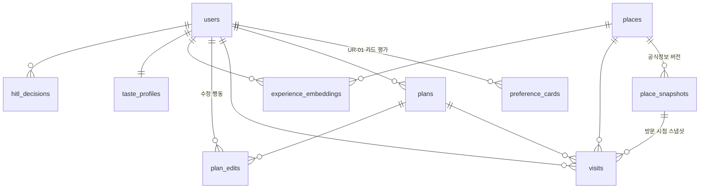

# CultureMate(MOBIDIC) 아키텍처 설계서

> 아카이브 기반 문화생활 개인화 멀티에이전트 · LangChain / LangGraph
> (MVP) — 원본 기획서 서비스 기획안 `PLANNING.md`
>
> **기능(UR) 축으로 소스를 찾으려면 → [FUNCTIONAL_MAP.md](FUNCTIONAL_MAP.md)**
> **기획안 원문과 구현 대조 → [PLANNING.md](PLANNING.md)**

---

## 0. 이 문서가 설계한 것

기획서의 핵심 주장은 한 문장으로 요약된다.

> **"아카이브는 기록장이 아니라 다음 판단의 근거다."**
> (기획안의 표현으로는 — **기록을 넘어 다음 행동에 개입하는 지능형 아카이브**)

이 주장이 성립하려면 시스템이 **네 가지**를 구조적으로 보장해야 한다.

| 주장 | 무너지는 방식 | 이 설계의 보장 장치 |
|---|---|---|
| 과거 경험이 다음 추천에 개입한다 | 아카이브를 사후 조회로만 쓰면 개입 시점을 놓친다 | `classify` 가 취향 프로필을 **선로드**하고, 아카이브를 탐색과 **같은 슈퍼스텝에서 병렬 조회**해 그 결과가 후보 점수·경고·대안의 입력이 된다 (§5, §11) |
| 실행 가능한 일정이다 | LLM이 이동시간·운영시간을 지어낸다 | 스케줄링은 **결정론적 코드**가 담당, LLM은 이유 서술과 취향 정렬만 (§7) |
| AI가 임의로 바꾸지 않는다 | 자동 수정이 편해서 슬쩍 넘어간다 | 검증 결과를 `auto_fixable` 기준으로 **강제 분기**, 사용자 판단 항목은 `interrupt()`로 그래프를 정지 (§8) |
| **기록이 다시 쌓인다** | 만든 일정을 **다시 열 수 없으면** 기록이 남지 않고, 첫 주장이 다음 바퀴에서 무너진다 | 일정을 `plans`에 날짜와 함께 영속화하고(§9), **캘린더로 되돌아가는 진입점**을 둔다 — **UR-28**(§12) |

네 가지 모두 구현돼 있다. 마지막 항목은 2026-08-17에 채웠다 — 그전까지는 기획안 4.3이
그린 선순환(탐색 → 일정 → 동선 → 기록 → 분석 → 다시 탐색)이 «다시 열기»가 없어
«04 기록»에 도달하지 못했다. 나머지는 이 네 가지를 지탱하기 위한 배관이다.

---

## 1. 설계 원칙

1. **필요한 Agent만 실행한다.** 모든 요청에 전체 그래프를 돌리면 지연과 비용이 요청 유형과 무관하게 균일해진다. 라우터가 실행 계획(`PlanFlags`)을 만들고 조건부 팬아웃이 그 계획대로만 노드를 깨운다.
2. **독립적인 작업은 병렬로.** 문화행사 탐색 / 상시공간 탐색 / 웹검색, 지도·날씨·운영시간 분석, 6종 검증은 서로 의존이 없다. LangGraph 슈퍼스텝과 `Send` 팬아웃으로 병렬화한다.
3. **결정론과 확률론을 분리한다.** 시간·거리·제약 만족은 코드가, 자연어 이해와 서술은 LLM이 맡는다. 경계를 흐리면 재현성과 신뢰성이 함께 무너진다.
4. **모든 판단에 근거를 남긴다.** 노드는 결과와 함께 `Evidence`를 State에 누적한다. UR-14(판단 근거 확인)는 기능이 아니라 데이터 계약이다.
5. **외부 의존성 실패에 그래프가 멈추지 않는다.** 모든 외부 호출은 타임아웃 + 폴백을 갖고, LLM 구조화 출력도 규칙 기반 폴백을 갖는다.

---

## 2. 시스템 구성



**기술 스택** (기획서 명세 유지)

| 계층 | 선택 | 비고 |
|---|---|---|
| 오케스트레이션 | LangGraph 1.x | 조건부 분기 · 병렬 · 체크포인트 · interrupt |
| 모델 | NVIDIA NIM (`ChatNVIDIA` / `NVIDIAEmbeddings` / `NVIDIARerank`) | `LLM_BACKEND` 로 OpenAI·Anthropic 교체 가능 |
| 백엔드 | FastAPI + SSE | 스트리밍 토큰과 interrupt 이벤트를 한 채널로 |
| 저장소 | PostgreSQL 18 + pgvector | 사실·계획·경험·벡터를 한 DB에 (조인 가능한 개인화) |
| 클라이언트 | **React Native** | 지도·타임라인·HITL 카드. 현장 재계획이 핵심 시나리오라 모바일 우선 (§10) |
| 배포 | Docker Compose → K8s | NIM은 GPU 노드 분리 |

> **모델 배치**: 역할별로 모델을 나눈다. 전량 대형 모델을 쓰면 일정 1건당 LLM 호출이 10회를 넘어 지연이 사용자 체감 한계를 넘기 때문이다. **다만 «큰 모델일수록 정확»이 성립하지 않았다** — `meta/llama-3.3-70b-instruct` 는 무료 티어에서 구조화 출력이 30~60초 걸려 라우터·writer 는 타임아웃, planner 는 44초가 나온다. 실측으로 정한 배선과 근거는 [REQUIREMENTS.md §5.3](REQUIREMENTS.md).

---

## 3. 메인 그래프



**노드 11개 = 서브그래프 4 + 조율 7.** `build.py` 의 `add_node` 호출 수와 같다.
노드 책임은 명확히 분리된다. **파란 노드는 서브그래프**(실제 로직), 나머지는 조율만 한다.

| 노드 | 역할 | 구현 |
|---|---|---|
| `classify` | 발화 → `RequestType` + `TripConditions` + `PlanFlags` | `app/graph/router/` |
| `archive` | 개인 아카이브 선조회, 경고 후보 생성 | `subgraphs/archive.py` |
| `discovery` | 행사·상시공간·웹 탐색 + 공식정보 검증 | `subgraphs/discovery.py` |
| `current_plan` | 수정·재계획 요청 시 기존 일정 로드 | `nodes.load_current_plan` |
| `merge_context` | 병렬 브랜치 합류점(공유 상태 통합) | `nodes.merge_context` |
| `itinerary` | 제약 수집 → 순서·시각 편성 → 공백 채우기 | `subgraphs/itinerary/` |
| `validation` | 6종 병렬 검증 → 자동/수동 분류 → 카드 생성 | `subgraphs/validation.py` |
| `hitl` | `interrupt()` 로 정지, 사용자 선택 수신 | `nodes.human_review` |
| `finalize` → `persist` | 선택 반영, 일정·수정행동 저장 | `nodes.py` |
| `compose` | 근거를 포함한 최종 응답 | `nodes.compose` |

**`hitl → itinerary` 역방향 엣지**가 "사용자 선택 → 재계획" 루프다. `MAX_REPLAN_ROUNDS=2`로 순환을 끊는다.

---

## 4. State 설계

### 4.1 단일 루트 State

모든 단계 산출물을 하나의 `CultureMateState`에 누적한다. 노드 간 인자 전달이 아니라 상태 누적을 택한 이유는 두 가지다. (1) 체크포인터가 임의 시점 상태를 복원할 수 있어야 HITL 재개가 성립한다. (2) 최종 응답이 "어떤 근거로 이렇게 됐는지"를 답하려면 중간 산출물이 전부 남아 있어야 한다.

```python
class CultureMateState(TypedDict, total=False):
    # ---- 입력 / 세션 ----
    user_id: str
    messages: Annotated[list, add_messages]
    raw_query: str

    # ---- 라우팅 ----
    request_type: RequestType
    flags: PlanFlags                             # 실행 계획
    conditions: TripConditions                   # 구조화된 조건(좌표 확정 포함)
    conditions_override: dict[str, Any] | None   # 네이티브 클라이언트가 주입(GPS 등)
    route_reason: str
    deadline: float                              # 응답 예산 종료 시각(monotonic)

    # ---- 아카이브 · 개인화 ----
    archive_hits:  Annotated[list[ArchiveHit],  MERGE_BY_ID]
    edit_signals:  Annotated[list[EditSignal],  MERGE_BY_ID]
    taste_profile: TasteProfile | None
    place_diffs:   Annotated[list[PlaceDiff],   MERGE_BY_ID]

    # ---- 탐색 · 검증 ----
    candidates:    Annotated[list[Candidate],    merge_candidates]
    verifications: Annotated[list[Verification], MERGE_BY_ID]

    # ---- 컨텍스트(병렬 분석 결과) ----
    context: Annotated[dict[str, Any], merge_dict]   # geo/hours/weather/pref

    # ---- 일정 ----
    current_itinerary: Itinerary | None          # 수정 요청 시 기존 일정
    itinerary: Itinerary | None
    gaps:      Annotated[list[Gap],       MERGE_BY_ID]
    nearby:    Annotated[list[Candidate], merge_candidates]
    replan_round: int

    # ---- 검증 · HITL ----
    issues:     Annotated[list[Issue],    replace_list]
    advisories: Annotated[list[Advisory], replace_list]
    decisions:  Annotated[list[Decision], MERGE_BY_ADVISORY_ID]
    needs_user_confirm: bool

    # ---- 출력 ----
    evidence: Annotated[list[Evidence], MERGE_BY_ID]
    answer: str
    trace:  Annotated[list[str], append_unique_str]
    error: str | None
```

> 위는 `app/graph/state.py` 의 `CultureMateState` **전량**이다(29개 키). 발췌가 아니다 —
> 키를 빼고 적으면 «없는 키를 새로 만들면 되겠다»는 오해가 생기고, 실제로 그 키가
> `serde.ALLOWED_TYPES` 에 없어 체크포인트 직렬화에서 터진다.

### 4.2 리듀서: 왜 `operator.add`가 아닌가

병렬 노드와 서브그래프가 같은 키에 쓴다. 서브그래프는 **입력으로 받은 누적값을 그대로 되돌려주므로** `operator.add`를 쓰면 매 합류마다 리스트가 중복 증식한다. 전 컬렉션에 **id 기준 멱등 병합**(`merge_by_id`)을 적용해 몇 번을 합쳐도 결과가 같게 만들었다.

**장소 목록 두 채널(`candidates`·`nearby`)은 `merge_candidates`를 쓴다.** 같은 장소가 공공 API·웹·지도에서 서로 다른 필드 조합으로 오기 때문에, canonical place 기준으로 묶고 **빈 필드는 채우고 점수는 max**로 합친다. (서브그래프 안의 `raw_candidates`도 같은 리듀서를 쓴다.)

**검증 결과(`issues`·`advisories`)만 누적하지 않고 교체한다**(`replace_list`). 검증은 매 라운드 현재 일정을 처음부터 다시 보므로, 지난 라운드의 이슈는 이미 해결됐거나 그 장소가 일정에서 빠졌을 수 있다. 누적하면 그것들이 영원히 남는다 — 실제로 재계획을 돌수록 카드가 불어나 **이슈 6건이 카드 21장**이 됐고, 일정에서 사라진 장소가 `일정 확인 필요`라는 이름 없는 카드로 계속 떠 있었다. 빈 리스트는 무시한다(검증을 타지 않은 경로가 기존 카드를 지우면 안 된다).

> **실무 함정 하나.** LangGraph는 같은 채널이 여러 스키마에 나타나면 리듀서의 *객체 동일성*까지 비교한다. `merge_by_id()`를 호출할 때마다 새 함수가 생기므로 `Channel 'x' already exists with a different type` 에러가 난다. `reducers.py`에 싱글턴(`MERGE_BY_ID`)을 두고 전부 재사용한다.

### 4.3 서브그래프 입출력 스키마

서브그래프를 노드로 직접 부착하면(체크포인트·스트리밍이 유지되는 방식) 입력으로 받은 키까지 그대로 반환된다. `archive`와 `discovery`가 병렬로 도는 순간 둘 다 `user_id`를 반환해 `InvalidUpdateError: Can receive only one value per step`가 발생한다.

각 서브그래프에 **출력 스키마를 명시**해 부모로 흘려보낼 키를 통제한다.

```python
StateGraph(ArchiveState, output_schema=ArchiveOutput)
#  ArchiveState  : user_id, raw_query, conditions, candidates, current_itinerary(입력)
#                  + facets, facet_hits(private)
#  ArchiveOutput : archive_hits, edit_signals, taste_profile, evidence, trace
```

private 키(`facet_hits`)는 부모 State를 오염시키지 않고, 입력 전용 키(`user_id`)는 충돌하지 않는다.

**다만 «출력 스키마를 전부 분리한다»가 아니다.** `evidence`·`trace`는 두 서브그래프가 같은 이름으로 내보내고, 리듀서가 있어 안전하다. 나누는 대상은 **리듀서가 없는 키**뿐이다.

> **그림** — [병렬 실행 시 키 충돌이 나는 이유 · 출력 스키마로 막는 법](diagrams/parallel-key-conflict.svg)

---

## 5. 쿼리 라우팅

기획서의 "주요 요청별 실행 경로"를 그대로 테이블로 옮겼다.

| RequestType | archive | discovery | current_plan | itinerary | 부가 |
|---|:--:|:--:|:--:|:--:|---|
| `archive_query` | ● | | | | 과거 기록 질문 |
| `place_recommend` | ● | ● | | ● | 추천도 일정을 만든다(아래) |
| `plan_create` | ● | ● | | ● | `nearby_fill` |
| `plan_modify` | ● | | ● | ● | |
| `revisit_plan` | ● | ● | | ● | `freshness_diff` |
| `weather_adjust` | ● | ● | ● | ● | |
| `gap_fill` | ● | ● | ● | ● | `nearby_fill` |

**7종이다.** 예전에는 `taste_report` 를 포함해 8종이었으나 `report` 서브그래프와 함께
제거됐다(FUNCTIONAL_MAP §7). 취향 리포트는 그래프를 타지 않고 `GET /report/{user_id}` 로만
간다 — `schemas.RequestType` 에도 `taste_report` 는 없다.

> **`place_recommend`도 일정을 만든다.** '추천'이라고 장소만 나열하면 지도·동선이 비어
> 화면이 성립하지 않고, 사용자는 "그래서 몇 시에 어디부터?"를 다시 물어야 한다.
> 추천과 일정 생성을 가르는 건 사용자의 관심사가 아니라 우리 내부 구분일 뿐이다.

**왜 LLM 오케스트레이터가 아닌 정적 테이블인가.** MVP 단계에서 라우팅 규칙은 7행짜리 테이블이다. 여기에 LLM을 넣으면 비용·지연·비결정성이 모두 늘고, 잘못된 라우팅의 원인 추적이 어려워진다. 대신 **교체 지점을 하나로 좁혀 두었다**: 예약·교통·주차·혼잡도 Agent가 추가돼 규칙이 조합 폭발하는 시점에 `router.fan_out()` 함수 하나만 LLM 플래너로 바꾸면 나머지 그래프는 손대지 않는다.

발화 분류(`classify`)는 구조화 출력을 쓰되, 실패 시 키워드 규칙으로 폴백한다. 라우터가 죽으면 전체가 죽기 때문에 여기만은 이중화한다.

---

## 6. 아카이브 · 개인화 (핵심)

### 6.1 서브그래프



### 6.2 왜 facet으로 쪼개는가

단일 질의 임베딩은 "성수동 전시 추천"에 대해 **비슷한 전시 기록**만 잘 잡는다. 하지만 이 서비스가 놓치면 안 되는 건 오히려 다음 두 가지다.

- *"차 갖고 가족과 갔을 때"* 라는 **상황**이 비슷했던 기록
- *"주차가 불편해서 다음에 뺐던"* 이라는 **불편·수정 행동** 기록

이 셋은 임베딩 공간에서 서로 다른 이웃이다. 하나의 질의로는 동시에 못 잡는다. 그래서 질의를 3개 facet으로 분해하고 `Send`로 병렬 검색한다.

| facet | 목적 | 검색 대상 |
|---|---|---|
| `similar_place` | 유사 장소·지역·카테고리 | visit, review, note |
| `context_match` | 동행자·이동수단·계절·날씨 일치 | visit, review, plan_edit |
| `friction_edit` | 불편 경험 + 일정 수정 행동 | visit, review, plan_edit |

### 6.3 검색 파이프라인

```
질의 3종
  │
  ├─ dense    : pgvector HNSW (cosine)   ─┐
  └─ lexical  : tsvector ts_rank_cd      ─┤
                                          ├─ RRF (facet 내부)
                                          │     w_dense/(k+rank) + w_lex/(k+rank)
                                          ▼
                            개인화 보정 (facet 내부)
                              × 최신성 감쇠  0.5^(age/half_life)
                              × 불편 가중    1 + β·min(|friction|,3)
                              × 상황 일치    +0.15 동행자, +0.15 이동수단, +0.10 지역
                                          │
                                          ▼
                              RRF (facet 간 재융합)   ← 여러 facet에 잡힌 기록 = 강한 신호
                                          │
                                          ▼
                              NVIDIARerank (cross-encoder) → top-k
```

설계 판단 세 가지:

**(a) 왜 하이브리드인가.** 개인 기록에는 고유명사(장소명·전시명)가 많다. 순수 dense 검색은 "리움미술관"과 "국립현대미술관"을 지나치게 가깝게 본다. lexical 랭커가 이 오류를 잡고, RRF가 두 랭킹을 스케일 차이 없이 합친다.

**(b) 왜 불편 기록을 의도적으로 부스트하는가.** 이 시스템에서 **정확도보다 경고 재현율이 중요하다.** 관련 없는 경고를 한 번 더 보여주는 비용은 "카드 하나 넘기기"지만, 주차 불편을 놓치면 사용자가 현장에서 그 대가를 치른다. `FRICTION_BOOST=0.35`는 이 비대칭을 반영한 값이며 운영 데이터로 재조정할 파라미터다.

**(c) 왜 최신성 감쇠를 곱하는가.** 3년 전 운영시간 기록이 지금 판단의 근거가 되면 안 된다. 반감기 180일 기본값에, 최신성 영향을 완전히 0으로 만들지 않도록 `0.4 + 0.6·decay` 형태로 하한을 둔다(오래됐어도 강한 불편 기록은 여전히 유효하다).

### 6.4 "검색됨"과 "알려야 함"의 분리

`extract_relevant`는 검색된 기록 중 **현재 일정에 실제로 영향을 주는 것만** 골라낸다. 단순 취향 일치는 후보 점수(`personal_score`)로 조용히 반영하고, 경고 카드로 올리지 않는다. 이 게이트가 없으면 사용자는 매 요청마다 "예전에 여기 좋아하셨죠" 카드를 5장씩 받게 되고, 정작 중요한 경고가 묻힌다.

### 6.5 쓰기 경로 — 수정 행동을 학습한다

```
방문 기록 / 일정 diff
   → summarize_experience (fast 모델, 구조화 출력)
        summary(검색용 서술문) + tags + friction[] + sentiment
   → embed → experience_embeddings (upsert, source 기준 멱등)
   → rebuild_profile (SQL 집계) → taste_profiles
```

`extract_edit_signals(before, after)`는 두 일정 버전의 diff에서 암묵적 선호를 뽑고,
`nodes._decision_signals(state)`는 확인 카드에서 사용자가 고른 것을 같은 어휘로 읽는다.
둘을 합쳐 `plan_edits` 에 남기고(신호 하나 = 행 하나), `rebuild_profile()` 이 되읽는다.

| 수정 행동 | 해석 | 가중치 |
|---|---|---|
| 삭제 | 이 유형 회피 | 1.0 |
| 교체 | 방향성 있는 선호(먼 곳 → 가까운 곳) | 0.9 |
| 체류시간 증가/감소 | 관심 강도 | 0.7 |
| 순서 변경 | 시간대 선호 | 0.5 |

별점은 사후 합리화가 섞이지만 **수정 행동은 그 순간의 실제 선택**이다. 기획서 차별점 4의 근거이자, 이 시스템이 별점만 보는 추천기와 갈리는 지점이다.

### 6.6 4계층 메모리

| 계층 | 테이블 | 성격 | 갱신 시점 |
|---|---|---|---|
| 일화 기억 | `visits` | 실제 방문 경험 원본 | 방문 기록 저장 시 |
| 행동 기억 | `plan_edits` | 삭제·교체·순서·체류시간 변경 | 일정 수정 시 |
| 검색 인덱스 | `experience_embeddings` | 위 둘의 검색 가능한 파생 표현 | 원본 저장 직후(파생) |
| 집계 프로필 | `taste_profiles` | 누적 경향(카테고리 분포, 실내외 편향 등) | 방문 저장 후 / 야간 배치 |

원본과 검색 표현을 분리한 이유: 임베딩 모델을 교체하면 인덱스는 재생성해야 하지만 원본은 건드리면 안 된다.

---

## 7. 탐색·검증과 일정 편성

### 7.1 탐색·검증 서브그래프



기간형 행사와 상시 공간을 **같은 레인**에서 다룬다. 행사가 없는 날짜·지역에서도 일정이 성립해야 한다는 요구를 조건문이 아니라 구조로 보장하기 위해서다.

`search_catalog`(내장 장소 카탈로그)가 **바닥을 받친다.** 외부 소스만으로는 결과가 0건이 되는 경우가 잦다 — 키 미설정, 쿼터 초과, 공공 API가 소규모 공간을 안 담음. 외부 호출 없이 즉시 응답하는 레인이 하나 있어야 "아무것도 안 나온다"가 사라진다.

`normalize`가 검증 앞에 오는 이유는 비용이다. 검증은 후보당 웹 호출을 유발하므로, 기간 이탈·제외 조건·중복을 먼저 걷어내고 랭킹 풀로 상위 `CANDIDATE_POOL`(60)개만 남긴 뒤, 그중 **상위 `VERIFY_TOP_K`(12)개만** `Send`로 검증한다(동시 실행 `VERIFY_CONCURRENCY=8`, 예산이 부족하면 갈래 수를 더 줄인다).

**검증 결과 3분류**: `verified`(공식 출처 일치) / `needs_check`(정보 부족 → 점수 0.8배 감점 후 "확인 필요" 표시로 노출) / `excluded`(불일치·종료 → 제외). `needs_check`를 배제하지 않는 게 중요하다. 소규모 공방·독립서점은 공식 정보가 원래 부실하고, 이들을 전부 떨구면 "상시 문화공간 추천"이라는 차별점이 사라진다.

**재방문 diff**: `freshness_diff` 플래그가 켜지면 마지막 방문 시점의 `place_snapshots`와 현재 공식정보를 비교해 운영시간·휴관일·입장료·예약방식·위치·프로그램·주차·임시휴관 8개 필드의 변경을 `PlaceDiff`로 만든다. 이게 기획서 차별점 2의 구현체다.

### 7.2 일정 편성 서브그래프



**스케줄링 알고리즘.** greedy nearest-feasible — 남은 후보 중 `점수 − 이동패널티`가 최대이면서 운영시간과 종료시각 제약을 만족하는 장소를 반복 선택한다.

```
score(c) = final_score(c) − travel_min/120
           − dist(c, 도착지)/20 × pull        ← 도착지 지정 시, 마지막 자리에서만
           + (10 if 사용자 확정 장소 else 0)
제약      arrive = cursor + travel(pos→c)
          depart = arrive + dwell(c)
          depart ≤ day_end  ∧  운영시간 내  ∧  휴관일 아님
```

도착지 항의 `pull`은 남은 자리가 2개 미만일 때만 0을 벗어난다. 오전부터 작동하면
거리만으로 좋은 장소를 일찍 배제해 '도착지 지정'이 일정 전체를 망친다.

장소 3~6개 규모에서 최적해와 거의 차이가 없고 결과가 재현 가능하다. 규모가 커지면 **이 함수 하나만** OR-Tools VRPTW로 교체하면 된다(입출력 계약은 `candidates + travel_matrix → Itinerary`).

`+10` 보너스는 HITL에서 사용자가 "유지"를 선택한 장소가 재계획 때 밀려나지 않도록 하는 잠금 장치다. 사용자 결정을 뒤집지 않는다는 원칙을 점수 함수 안에 박아 넣었다.

**날씨 반영**은 후보 점수 보정으로 처리한다(악천후 시간대: 실내 +0.2, 야외 −0.3). 하드 제약으로 만들면 비 오는 날 야외 축제가 목적인 사용자의 요청을 시스템이 거부하게 된다.

**공백 채우기**는 40분 이상 유휴 구간과, 첫 일정 이전·종료 후의 60분 이상 잔여 시간을 찾아, 시각대에 따라 목적(식사/휴식/자유)을 정하고 `공백 × 카테고리`로 `Send` 팬아웃한다. 반경은 남은 시간에 비례(60분 미만 500m, 이상 1200m)해 "가면 못 돌아오는 추천"을 막는다.

---

## 8. Human-in-the-loop과 설명가능성

### 8.1 검증 서브그래프

6종 검증이 병렬로 돌고 `triage`가 자동/수동을 가른다.

| 검사 | severity | auto_fixable | 근거 |
|---|:--:|:--:|---|
| `closed` 휴관일 충돌 | 3 | ✗ | 대체 장소는 취향 문제라 자동 결정 불가 |
| `unreachable` 이동 불가 | 3 | ✓ | 시각 조정은 기계적 |
| `overlap` 시간 중복 | 2 | ✓ | 동일 |
| `hours_conflict` 미검증 운영정보 | 2 | ✗ | 사용자가 감수 여부를 판단 |
| `weather_risk` 악천후 야외 | 2 | ✗ | 강행 의사는 사용자 몫 |
| `past_friction` 과거 불편 재발 | 2 | ✗ | 기획서의 핵심 요구 |
| `revisit_change` 재방문 변경사항 | 2 | ✗ | 동일 |

`auto_fixable=False` **이면서** `severity ≥ SEVERITY_THRESHOLD_FOR_HITL(2)`인 이슈만 사용자에게 올라간다. 이 두 조건을 코드 상수가 아니라 이슈 속성으로 둔 이유는, 어떤 이슈가 자동 처리 대상인지가 제품 정책이지 구현 디테일이 아니기 때문이다.

### 8.2 확인 카드의 데이터 계약

```jsonc
{
  "type": "confirm_plan_changes",
  "itinerary": { /* 현재 일정 전체 */ },
  "advisories": [{
    "id": "...", "kind": "friction", "severity": 2,
    "title":   "리움미술관 확인 필요",
    "message": "이전 방문에서 주차가 불편했다고 기록했어요.",
    "evidence_ids": ["exp_8f21"],              // → 판단 근거 원문 조회
    "options": [
      {"id":"o1","label":"그대로 방문","action":"keep",
       "predicted_effect":"일정 변동 없음. 같은 불편이 재발할 수 있음"},
      {"id":"o2","label":"인근 주차장 추가","action":"add_parking",
       "predicted_effect":"도보 5분 내외 추가, 주차 대기 감소"},
      {"id":"o3","label":"비슷한 장소로 교체","action":"replace",
       "predicted_effect":"동선 재계산 후 대체 후보 배치"}
    ]
  }],
  "evidence": [ /* archive · official · web · weather · maps · rule */ ]
}
```

카드에는 항상 **(1) 발견된 문제 (2) 관련 기록·공식정보 (3) 일정에 미치는 영향 (4) 변경 이유 (5) 선택지**가 들어간다. 기획서 목표 5의 5개 항목을 스키마 필드로 고정해, 구현이 빠뜨릴 수 없게 만들었다.

첫 선택지는 항상 **"그대로 진행"**이다. AI가 변경을 기본값으로 제시하면 사용자는 사실상 자동 변경을 승인하게 된다.

### 8.3 중단과 재개

```python
response = interrupt(payload)     # 체크포인터에 상태 저장 후 실행 정지
```

```
POST /chat   → SSE: event: interrupt  { advisories, evidence, itinerary }
POST /resume → Command(resume={"decisions":[{advisory_id, option_id}]})
             → 정확히 interrupt() 지점부터 재개
```

`after_review`가 선택된 옵션의 `action`을 보고 재계획 필요 여부를 판단한다. `keep`만 선택됐다면 `finalize`로 직행하고, `replace/reorder/drop/add_place/change_transport/shift_time/add_parking`(7종) 중 하나라도 있으면 `itinerary`로 되돌아간다.

> ⚠️ **Python 3.11+ 필요.** LangGraph의 `interrupt()`는 async 노드에서 runnable config를 contextvar로 전파받는데, 이 전파가 `asyncio` 컨텍스트 인자에 의존한다(3.11+). 3.10에서는 async 노드의 interrupt가 동작하지 않는다. `pyproject.toml`에 `requires-python = ">=3.11"`로 못 박았다.

### 8.4 설명가능성 (UR-14)

`Evidence`는 7종 출처(`archive` / `official` / `web` / `weather` / `maps` / `profile` / `rule`)를 갖고 State에 누적된다. 일정 항목의 `evidence_ids`와 카드의 `evidence_ids`가 이를 참조하므로, UI는 "왜 이 장소가 여기 있나"에 대해 원문 근거를 그대로 펼칠 수 있다. `trace`는 실행 경로 기록으로 디버깅과 성능 분석에 쓴다.

---

## 9. 데이터 모델



설계 축은 **사실 / 계획 / 경험 / 검색 / 집계**의 분리다.

- **사실** `places`, `place_snapshots` — 스냅샷을 버전으로 쌓아야 재방문 diff의 기준점이 생긴다.
- **계획** `plans`(JSONB로 Itinerary 전체), `plan_edits`(수정 행동 원자 단위)
  - `plans` 는 `plan_date` 를 키의 한 축으로 갖고 `idx_plans_user_date (user_id, plan_date DESC)`
    를 건다. **캘린더(UR-28)가 새 스키마 없이 성립하는 이유가 여기다** — 저장은
    `nodes.persist → repo.save_itinerary()` 로 이미 되고 있고, 남은 것은 기간으로 읽는 질의뿐이다.
  - `plan_edits` 는 `nodes.persist → repo.save_plan_edits()` 가 쓰고 `profile.rebuild_profile()`
    이 읽는다(UR-09, 2026-08-17). 신호 하나가 행 하나이고, 같은 신호 id 는 다시 넣지 않는다 —
    확정 카드에서 나온 신호는 스레드 상태에 남아 다음 요청에서도 지나가기 때문이다.
- **경험** `visits` — `friction text[]`, `is_revisit`, `dwell_min`, `travel_min`까지 구조화 저장
- **검색** `experience_embeddings` — 위 셋의 파생 표현. `UNIQUE(source_type, source_id)`로 재생성 멱등성 확보
- **집계** `taste_profiles` — JSONB 프로필

**인덱스 전략**

```sql
-- dense: HNSW cosine (m=16, ef_construction=64)
CREATE INDEX idx_exp_embedding ON experience_embeddings
    USING hnsw (embedding vector_cosine_ops);
-- lexical: 하이브리드의 두 번째 랭커
CREATE INDEX idx_exp_ts       ON experience_embeddings USING gin (ts);
-- 필터: 사용자별 조회가 항상 선행
CREATE INDEX idx_exp_user     ON experience_embeddings (user_id, occurred_at DESC);
CREATE INDEX idx_exp_friction ON experience_embeddings USING gin (friction);
CREATE INDEX idx_exp_meta     ON experience_embeddings USING gin (meta jsonb_path_ops);
```

> **한국어 전문검색 주의.** `to_tsvector('simple', ...)`는 형태소 분석 없이 공백 토큰화만 한다. 이식성 우선으로 기본값을 잡았고, 회수율이 문제가 되면 `pg_bigm`(2-gram) 또는 `PGroonga`로 교체한다. 교체 지점은 `retriever._LEXICAL_SQL` 한 곳이다.

---

## 10. 클라이언트 (React Native / Expo)

> 구현체: [`mobile/`](../mobile) · Expo SDK 57 + expo-router. 서버 주소가 비어
> 있으면 목 어댑터로 붙어 백엔드 없이도 전체 플로우가 동작한다.
>
> 주소는 빌드타임 `EXPO_PUBLIC_API_URL` 로 시작하되 **연결 화면(`app/connect.tsx`)에서
> 런타임에 바꿀 수 있다.** 빌드타임 값 하나뿐이면 실기기의 LAN 주소·터널 주소가
> 바뀔 때마다 .env 를 고치고 앱을 다시 말아야 하고, 그 사이 사용자가 보는 것은
> "그냥 안 되는 앱"이다. 그래서 `src/config.ts` 는 상수 대신 `apiUrl()` · `isMock()`
> 을 노출하고, 호출부는 모듈 로드 시점이 아니라 **호출 시점에** 주소를 읽는다.

일정 서비스의 절반은 **현장에서** 쓰인다. "관람이 일찍 끝났다", "비가 오기 시작했다", "여기 주차가 또 안 된다" — 기획서가 말하는 차별점 3·5는 사용자가 지도를 들고 이동하는 중에 발생한다. 클라이언트를 React Native로 잡은 것은 이 시나리오를 전제한 선택이며, 아래 네 가지가 서버 설계에 실제로 영향을 준다.

### 10.1 스트리밍 — SSE와 폴백

React Native의 `fetch`는 Chrome/Node와 달리 **응답 본문 스트리밍을 지원하지 않는다**(Hermes/RN 네트워킹은 XMLHttpRequest 기반이라 본문을 전부 받은 뒤 넘긴다). 따라서 `/chat`의 `text/event-stream`을 그대로 읽을 수 없다.

| 방식 | 구현 | 권장 |
|---|---|---|
| `react-native-sse` (XHR `onprogress` 기반 EventSource 폴리필) | 토큰 스트리밍 + `event: interrupt` 수신 | ✅ 기본 |
| `POST /chat/sync` 비스트리밍 | 완료 후 JSON 1회 반환, interrupt 시 `status: "interrupted"` | 폴백 / 저사양 기기 |

서버는 두 경로 모두 **동일한 그래프·동일한 thread_id**를 쓴다. 스트리밍 여부는 전송 방식일 뿐 상태 모델이 아니다. 클라이언트도 이 차이를 화면까지 올리지 않는다 — `src/api/client.ts`가 두 경로를 같은 `StreamEvent` 스트림으로 정규화하고, 화면은 이벤트만 본다.

```
POST /chat        → event: token / update / interrupt / done
POST /chat/sync   → {"status":"interrupted", "interrupt":{...}}  또는
                    {"status":"done", "answer":..., "itinerary":..., "evidence_ids":[...]}
POST /resume      → 위와 동일 (Command(resume=...) 로 재개)
```

앱이 백그라운드로 내려가 연결이 끊겨도 **체크포인터에 상태가 남아 있으므로** 복귀 후 `GET /threads/{id}/state`로 현재 지점을 복원한다. 모바일에서 연결 단절은 예외가 아니라 상시 조건이라, HITL을 서버 측 인터럽트로 구현한 결정이 여기서 값을 한다.

### 10.2 위치 — `gap_fill`의 입력

`gap_fill`(일정 조기 종료) 라우트는 **현재 위치**가 없으면 성립하지 않는다. 앱은 `expo-location`(`src/hooks/useCurrentLocation.ts`)으로 얻은 좌표를 `TripConditions.origin`에 실어 보낸다.

```jsonc
POST /chat
{ "user_id":"...", "thread_id":"...",
  "message":"전시 일찍 끝났어. 2시간 남았는데 근처 뭐 있어?",
  "conditions_override": { "origin": {"lat":37.5445,"lng":127.0557} } }
```

서버는 이 좌표를 `detect_gaps`의 anchor로 사용해 반경 검색을 수행한다(§7.2). 위치 권한이 거부되면 마지막 일정 항목의 좌표로 폴백한다.

### 10.3 지도

네이버 지도는 RN용 공식 래퍼가 없어 **WebView 안에 네이버 지도 JS SDK를 띄우는 방식**을 쓴다(`src/components/NaverMap.tsx`, 웹 빌드에서는 iframe 폴백). 서버는 지도 SDK에 의존하지 않는다 — `Itinerary.map_path`(좌표 배열)와 `travel_min_from_prev`만 내려주고, 폴리라인 렌더링과 마커는 전적으로 클라이언트 책임이다. 지도 공급자를 교체해도 서버 계약은 그대로다.

### 10.4 네이티브 기능이 채우는 요구사항

| 요구 | 네이티브 활용 |
|---|---|
| UR-10 아카이브 기록 | 카메라 롤 사진 첨부 → `POST /visits` |
| 오프라인 | 확정 일정 JSON을 AsyncStorage에 저장(`src/store/storage.ts`). 네트워크 없이 타임라인·지도 조회 가능, 재계획만 온라인. 전송 실패한 방문 기록은 `synced=false`로 큐에 남겨 재시도 |

### 10.5 화면 구성

| 탭 | 하는 일 | 파일 |
|---|---|---|
| 오늘의 일정 | 요청 입력 → 노드 진행 → 타임라인+지도 → **확인 카드** → 선택 반영 | `app/(tabs)/index.tsx` |
| 큐레이션 | 내 방문 기록에서 뽑은 테마 지도, 컬렉션 저장·이동수단 재계산 | `app/(tabs)/curation.tsx` |
| 아카이브 | 방문 기록 목록, 일정에서 바로 기록 추가 | `app/(tabs)/archive.tsx`, `app/visit.tsx` |
| 취향 | 선호 카테고리, 실내외·재방문 성향, 불편 요소 | `app/(tabs)/report.tsx` |
| **서버 연결** | 주소 입력·프리셋 → `GET /health` 확인 → 저장, 목 모드 전환, `GET /diagnostics` 로 서버가 가진 키 표시 | `app/connect.tsx` |
| **캘린더** ★ | **월 그리드 → 날짜 탭 → 그날 일정(타임라인+지도) · 기록 없는 지난 일정은 «기록 남기기»로** | ✅ `app/(tabs)/calendar.tsx` (UR-28) |

핵심 플로우를 라우팅으로 쪼개지 않았다. 사용자는 "일정 생성 → 경고 확인 → 선택 → 일정 변경"을
**하나의 사건**으로 경험하는데, 화면을 나누면 무엇 때문에 일정이 바뀌었는지 맥락이 사라진다.

**캘린더는 그 사건의 «다음 날»을 맡는다.** 오늘의 일정 탭은 지금 진행 중인 하나의 사건이고,
캘린더는 **끝난 사건과 예정된 사건의 목록**이다. 둘을 한 탭에 합치면 진행 중 화면이
목록에 묻힌다. 반대로 캘린더에 편집 기능을 넣으면 안 된다 — 일정 변경은 오늘의 일정 탭의
재계획 경로 하나로 모아야 `plan_edits` 학습 신호가 한 갈래로 남는다(§6.5).

> **캘린더가 서버에 요구하는 것은 «기간 조회» 하나뿐이다.** 일정은 이미 `plans` 에
> `plan_date` 와 함께 저장된다(§9). 목록에는 **요약만**(날짜·장소 수·대표 이름) 내리고
> `payload` 전문은 날짜를 눌렀을 때 받는다 — 한 달치 `Itinerary` 를 그대로 실으면
> §10.6의 페이로드 제약이 깨진다.

UI가 강제하는 설계 규칙 두 가지(`src/components/AdvisoryCard.tsx`):

1. **첫 선택지는 항상 '그대로'.** 변경이 기본값이면 사용자는 사실상 자동 변경을 승인하게 된다.
2. **모든 선택지에 예상 효과를 표시한다.** 근거 없이 고르게 하지 않는다.

이 두 규칙은 문서 주석이 아니라 `npm run verify`의 회귀 테스트 항목이다.

### 10.6 서버가 지켜야 할 모바일 제약

- **페이로드 크기**: `/chat/sync` 응답에 `evidence` 전문을 다 실으면 수백 KB가 된다. 목록에는 `evidence_ids`만 내리고 원문은 `GET /threads/{id}/evidence/{eid}`로 지연 로드한다(앱에서는 '판단 근거 보기'를 눌렀을 때).
- **재시도 안전성**: 모바일은 요청 중복이 흔하다. `thread_id` + 체크포인터 조합으로 같은 요청 재전송이 상태를 두 번 진행시키지 않는다.
- **타임아웃**: 일정 생성은 병렬화해도 수 초가 걸린다. 스트리밍 경로에서 `update` 이벤트를 노드 단위로 흘려 진행 상황을 보여주고, 비스트리밍 경로는 클라이언트 타임아웃을 60초로 잡는다.
- **무거운 것은 첫 응답에서 뺀다**: 구간 실측(실제 경로 좌표)은 15초 예산에 들어가지 못한다. 넣으면 예산이 밀려 실측이 통째로 잘리고, 지도가 장소를 직선으로 잇는다. 그래서 일정을 먼저 내보내고 `POST /threads/{id}/routes` 로 뒤이어 채운다 — 근거는 §10.1과 같다. **사용자가 먼저 보고 싶은 건 '어디를 가는가'지 '선이 정확한가'가 아니다.** 좌표는 구간당 120점으로 솎아 페이로드를 줄인다.

---

## 11. 성능·비용 설계

| 항목 | 설계 | 근거 |
|---|---|---|
| 병렬 슈퍼스텝 | archive ∥ discovery, ctx 4종 ∥, 검증 6종 ∥ | 직렬 대비 왕복 수 1/3 |
| `Send` 팬아웃 | facet 3~6, 후보 검증 N, 공백×카테고리 | 개수를 사전에 모르는 작업 |
| 모델 분리 | 라우팅·요약·태깅 8B / 추론·판정 70B | 호출 빈도 × 단가 |
| 검증 상한 | `VERIFY_TOP_K=12` · `VERIFY_CONCURRENCY=8` (랭킹 풀은 `CANDIDATE_POOL=60`) | 외부 API 쿼터 보호 |
| TTL 캐시 | geocode 24h · 경로/행렬 30m~1h · 날씨 15m~30m · 웹검색 15m | 동일 지역 반복 조회가 많음 |
| 우아한 성능저하 | 모든 외부 호출 `safe_call`(타임아웃+기본값) | 도구 하나가 그래프를 멈추지 않게 |
| 체크포인트 | PostgresSaver, thread_id = 대화 세션 | HITL 재개의 전제 |

---

## 12. 요구사항 추적

**전량 목록과 상태는 [REQUIREMENTS.md §3.5](REQUIREMENTS.md)** 에 있다. 여기서는
**설계 결정이 어느 구조로 내려앉았는지**만 적는다. 상태 기호는 그 표와 같다
(✅ 구현 · ◐ 부분 · ⬜ 미구현 · ⬛ 제외).

| ID | 요구사항 | 상태 | 구현 위치 |
|---|---|:--:|---|
| UR-01 | 개인 취향 등록(카드) | ✅ | `preference_cards` → `profile._CARDS_SQL` → `taste_profiles`. 카드는 `preferred_categories`/`frequent_removals` 로 접힌다 (새 필드 없음) |
| UR-02 | 문화생활 조건 입력 | ✅ | `router.classify` → `TripConditions` |
| UR-03 | 문화 콘텐츠 통합 탐색 | ✅ | `discovery`: `search_catalog` ∥ `search_events` ∥ `search_always_on` ∥ `search_web` |
| UR-04 | 신뢰 가능한 정보 확인 | ✅ | `tools/verify.py` + `verify_status` 3분류 |
| UR-05 | 맞춤 일정 자동 생성 | ✅ | `itinerary.schedule` |
| UR-06 | 지도 기반 동선 확인 | ✅ | `Itinerary.map_path` + `tools/maps.travel_matrix` |
| UR-07 | 날씨 기반 일정 추천 | ✅ | `ctx_weather` → `assemble_constraints` 실내외 보정 |
| UR-08 | 주변 장소 추천 | ✅ | `detect_gaps` → `nearby_search` → `rerank_nearby` |
| UR-09 | 일정 직접 수정 | ✅ | `plan_modify` 라우트 + `persist → save_plan_edits` → `plan_edits` |
| UR-10 | 개인 아카이브 관리 | ✅ | `visits`, `plans`, `POST /visits` |
| UR-11 | 과거 경험 기반 개인화 | ◐ | `archive` 서브그래프 + `personal_score` (경고 생성은 제거됨) |
| UR-12 | 경험 기반 주의 알림 | ⬛ | `validation.check_archive` 삭제 |
| UR-13 | 대안 확인 및 선택 | ✅ | `Advisory.options` + `hitl` |
| UR-14 | AI 판단 근거 확인 | ✅ | `Evidence` 누적 + `evidence_ids` 참조 |
| UR-15 | 취향 리포트 | ✅ | `GET /report/{user_id}` (`report` 서브그래프는 삭제) |
| UR-16 | 일정 이미지 공유 | ⬛ | — |
| UR-17 | 개인정보 통제 | ✅ | `ON DELETE CASCADE` 전면 적용 |
| **UR-28** | **캘린더로 일정 확인** ★ | ✅ | `repo.list_plans` → `GET /plans/{user_id}` · `GET /plans/detail/{id}` → `(tabs)/calendar.tsx` |
| **UR-40** | 과거 불편의 선제 경고 복원 | ✅ | `validation.check_friction` 이 검증 6종 중 하나로 동작한다 (2026-08-17) |
| UR-18 | 행정구역 기반 지역 필터 | ✅ | `tools/region.py` → `discovery.normalize`. 근거는 [TEST.md §7](TEST.md) |
| UR-19~UR-27 | 지역 정확도 · 운영 개선 | ⬜ | 근거는 [TEST.md §7](TEST.md) |
| UR-29~UR-39 | 기획안 대조에서 추가 | ⬜/◐ | 근거는 [PLANNING.md §7](PLANNING.md) |

**설계상 의미가 있는 두 항목**

- **UR-28 은 새 구조를 요구하지 않는다.** §9의 «계획» 축(`plans`)이 처음부터 날짜를 키로
  갖고 있었기 때문이다. 이 문서가 사실/계획/경험/검색/집계를 분리해 둔 것의 값이 여기서 나온다 —
  화면 하나를 더하는 데 스키마가 움직이지 않는다.
- **UR-40 은 새 노드를 요구했다** (2026-08-17 완료). 검증이 5종에서 6종이 되면서
  `tests/test_docs_contract.py` 의 검증 개수 테스트가 먼저 깨졌고, 그 테스트 이름을
  `test_validation_runs_six_checks` 로 바꾸면서 §8.1 · STRUCTURE §6 을 같은 커밋에서 고쳤다.

---

## 13. 리스크와 대응

| 리스크 | 영향 | 대응 |
|---|---|---|
| 콜드 스타트 (아카이브 0건) | 차별점이 작동하지 않음 | **UR-01 카드 평가로 초기 프로필 부트스트랩** (2026-08-17), `archive` 결과 0건이어도 그래프 정상 진행 |
| **선순환 단절** (일정을 다시 못 봄) | 기록이 안 쌓여 다음 바퀴가 첫 사용자와 같아짐 | ✅ **UR-28 캘린더** (2026-08-17) — 지난 일정을 열고 «기록 남기기»로 잇는다 |
| **경고가 만들어지지 않음** | 기획안의 핵심 화면(선제적 알림)이 도달 불가 | ✅ **UR-40** (2026-08-17) — `validation.check_friction` 이 `past_friction` 을 생산한다 |
| 공공 API 정보 부실 | 상시 공간 추천 품질 저하 | `needs_check` 상태로 노출 + 웹검색 보강, 사용자 확인 후 스냅샷 축적 |
| LLM 구조화 출력 실패 | 라우팅·판정 중단 | 전 지점 규칙 기반 폴백 (`router`, `plan_facets`, `extract_relevant`) |
| 경고 피로 | 사용자가 카드를 무시 | `extract_relevant` 게이트 + `auto_fixable`·severity 이중 조건(§8.1), 카드는 validation 한 곳에서만 생성 |
| 한국어 lexical 회수율 | 하이브리드 절반이 무력화 | `pg_bigm`/PGroonga 교체 (변경점 1곳) |
| 임베딩 모델 교체 | 인덱스 전면 재생성 | 원본(`visits`)과 파생(`experience_embeddings`) 분리, `UNIQUE(source_type, source_id)`로 재생성 멱등 |
| 스케줄러 확장성 | 장소 10개+ 에서 greedy 품질 저하 | `schedule()` 단일 함수 교체(OR-Tools VRPTW) |
| RN fetch 스트리밍 미지원 | 토큰 스트리밍 불가 | `react-native-sse` 폴리필 + `/chat/sync` 폴백 (§10.1) |
| 모바일 연결 단절 | 진행 중 일정 유실 | 체크포인터 기반 재개 + `GET /threads/{id}/state` 복원 |

---

## 14. 확장 로드맵

기획안의 STEP 1(MVP·개인 아카이브 검증) → STEP 2(오케스트레이터 확장) →
STEP 3(공유·커뮤니티)에 아래를 맞췄다.

**Phase 1 (MVP, 현재)** — **7종 라우트, 4개 서브그래프**, HITL, 아카이브 하이브리드 검색,
외부 API 연동 9개 제공자(문화포털·기상청·NCP Maps·OpenRouteService·ODsay·Kakao Local(지오코딩 폴백)·NAVER 지역검색·Tavily·Exa(웹검색 폴백) — 진단 프로브 기준 11종)

**Phase 1.5 — 2026-08-17 에 셋 다 닫혔다.** 기획안 대조에서 드러난 구멍이었고,
셋 다 새 외부 의존 없이 끝났다.

1. **UR-28 캘린더** ✅ — `GET /plans/{user_id}` 기간 조회 + `GET /plans/detail/{plan_id}`
   + `(tabs)/calendar.tsx`. 구조 변경 없음(§9의 `plans` 를 그대로 읽는다).
2. **UR-40 선제 경고 복원** ✅ — `validation.check_friction` 추가. 검증 5→6종이라
   §8.1·STRUCTURE §6·계약 테스트를 함께 고쳤다.
3. **UR-09 `plan_edits` 기록** ✅ — `persist` 가 확정 카드 선택과 일정 diff 를 함께 저장하고
   (`repo.save_plan_edits`), `rebuild_profile()` 이 되읽는다. §6.5의 쓰기 경로가 반쪽으로
   남아 있던 상태를 닫았다.
4. **UR-01 취향 카드** ✅ — 콜드 스타트에서 `personal_score` 가 0.5 로 고정되던 자리.
   `POST /preferences/cards` → `repo.save_preference_cards` → `profile._CARDS_SQL`.
   **스키마도 `TasteProfile` 도 안 늘렸다** — 카드를 기존 두 필드로 접어 `personal_score()`
   를 그대로 뒀다. 대신 `preferred_categories` 에 처음으로 음수가 들어오므로, 그것을
   내림차순 상위로 «선호»라 읽던 네 자리에 `> 0` 필터를 함께 넣었다.

> **이동수단은 수단별로 다른 API가 실측한다.** NAVER Directions가 자동차만 제공하므로
> 도보·자전거는 OpenRouteService(`foot-walking`, Matrix로 N×N 1콜), 지하철·버스는
> ODsay LAB(`SearchPathType` 1=지하철 2=버스)로 나눠 받는다. 구현은 `tools/routing.py`.
>
> **세 API 모두 무료 티어다.** 유료 경로 API를 섞으면 배포에 고정비가 생기고,
> 키가 없는 심사·데모 환경에서는 그 구간이 통째로 비어 일정이 성립하지 않는다.
> 이 전제는 `tests/test_tools.py::test_routing_uses_only_free_providers` 가 지킨다.
>
> 키가 없거나 예산이 부족해 실측하지 못하면 직선거리 추정으로 내려가되, 그때는
> `travel_source='estimate'`를 남겨 일정 항목의 `reason`에 `(추정)`이 붙는다 —
> 값을 숨기는 것보다 출처를 밝히는 편이 낫다.

**Phase 2** — 예약·교통·주차·혼잡도 Agent 추가. 이 시점에 `router.fan_out()`을 LLM 오케스트레이터로 교체하고, 각 Agent를 서브그래프로 추가한다(메인 그래프 구조 변경 없음). 기획안의 UR-29(기간 배지)·UR-30(저장 목록 → 일정)·UR-35(파생 제약 자동 산출)도 여기서.

**Phase 3** — 온라인 학습(수정 행동 → 랭커 재학습), 그룹 일정(동행자 취향 병합), LangGraph Store 기반 크로스 스레드 장기 메모리. 기획안 STEP 3의 공유·커뮤니티(UR-16)와 예약·티켓 연결(UR-39)이 여기 붙는다 — **개인 아카이브가 먼저 작동해야 «남의 코스 목록»이 되지 않는다.**

**평가 축** (Phase 2 진입 전 확보 권장)

- 검색: facet별 Recall@k, 불편 경험 재현율(놓친 경고 비율)
- 일정: 제약 위반율(운영시간·이동 불가), 사용자 수정률
- HITL: 카드 수용률, 카드당 결정 시간
- 비용: 요청 유형별 LLM 호출 수 · p95 지연

---

## 부록 A. 디렉터리 구조

```
culturemate/
├── app/
│   ├── config.py              # 전역 설정(환경변수 단일 진입점)
│   ├── schemas.py             # 도메인 모델 (Candidate·ArchiveHit·Advisory·Itinerary …)
│   ├── graph/
│   │   ├── state.py           # State + 서브그래프 입출력 스키마
│   │   ├── reducers.py        # 멱등 병합 리듀서 (+ 싱글턴)
│   │   ├── router/            # 쿼리 분류 + 라우팅 테이블 + 팬아웃 (6모듈)
│   │   ├── nodes.py           # 조율 노드 (merge / hitl / finalize / persist / compose)
│   │   ├── budget.py          # 시간 예산 — 비용 기반 단계 축소
│   │   ├── serde.py           # 체크포인트 직렬화 화이트리스트
│   │   ├── build.py           # 메인 그래프 조립
│   │   └── subgraphs/
│   │       ├── archive.py     # facet 병렬 검색 → RRF → 경고 카드
│   │       ├── discovery.py   # 행사·상시·웹 병렬 탐색 → 검증
│   │       ├── itinerary/     # 제약 병렬 수집 → 스케줄 → 공백 채우기 (9모듈)
│   │       └── validation.py  # 6종 병렬 검증 → triage → 카드
│   │                          #   (report.py 는 삭제됨 — 취향 리포트는 GET /report)
│   ├── memory/
│   │   ├── retriever.py       # 하이브리드 + RRF + 리랭크 + 개인화 보정
│   │   ├── writer.py          # 경험 요약·태깅·임베딩, 수정행동 신호 추출
│   │   ├── profile.py         # 취향 프로필 집계·온라인 갱신
│   │   └── curation.py        # 방문 기록 → 테마 컬렉션
│   ├── llm/{provider,prompts}.py
│   ├── tools/                 # http · base(캐시) · maps · routing · culture_api
│   │                          # weather · websearch · verify · local_catalog
│   │                          # kakao_local(지오코딩 폴백) · region(행정구역 필터)
│   ├── db/{session,repo}.py
│   └── api/{main,schemas}.py
├── db/001_schema.sql
├── docs/{ARCHITECTURE, STRUCTURE, REQUIREMENTS, FUNCTIONAL_MAP, PLANNING,
│         SETUP, PROGRESS, TEST, TEST_FUNCTIONAL, HANDOFF,
│         AGENT_ROLES, AGENT_WORKFLOW, SYSTEM_C4}.md, diagrams/*.{mmd,svg}
├── scripts/render_graph.py    # 그래프 → Mermaid 덤프
├── tests/                     # 그래프 구조 · 아카이브 랭킹 · 스케줄 제약 · HITL 분기
└── mobile/                    # React Native (Expo SDK 57)
    ├── app/                   # expo-router: (tabs)/{index,calendar,curation,archive,report}
    │                          #   + visit · connect(서버 연결) · taste-cards(UR-01)
    └── src/
        ├── api/{client,mock,types}.ts   # SSE+sync 정규화 / 목 백엔드 / 서버 스키마 미러
        ├── components/                  # Timeline · AdvisoryCard · EvidenceSheet · NaverMap
        │                                # PlaceFacts · TransportPicker · RoutePoints …
        ├── constants.ts                 # KIND_LABEL · FRICTION_LABEL (단일 원천)
        ├── hooks/useCultureMate.ts      # idle → running → awaiting_confirm → done
        └── store/storage.ts             # 오프라인 캐시 + 미동기화 기록 큐
```

## 부록 B. 검증 상태

```
$ pytest -q                    # 서버
193 passed, 1 skipped (수집 194개)  # skip: interrupt 왕복 테스트 — 그 입력에서 확인 카드가
                               #       생기지 않은 회차. 환경 문제가 아니다.

$ cd mobile && npm run typecheck && npm run verify && npm run export
TYPECHECK OK
모든 계약 검증 통과 (17항목)
Exported: dist                 # 전체 앱 번들 컴파일 성공
```

**실서버 왕복 확인** (uvicorn + `LLM_BACKEND=fake`, 체크포인터는 InMemory 폴백):

| 엔드포인트 | 결과 |
|---|---|
| `GET /health` | 200 |
| `POST /chat/sync` | 200 · 응답 키가 클라이언트 `SyncResult` 타입과 일치 |
| `GET /threads/{id}/state` | 200 · `conditions_override`의 GPS·이동수단이 그래프 State까지 도달 확인 |
| `GET /threads/{id}/evidence/{eid}` | 200 · 근거 원문 지연 로드 |
| `POST /resume/sync` | 200 |
| `POST /visits` | 200 · DB 부재 시 `{"ok": false, "reason": "archive_unavailable"}` (500 아님) |
| `GET /diagnostics?probe=true` | 200 · 5개 외부 API를 실제 호출해 설정 상태 보고 |

**외부 연동 검증** — 네트워크·키 없이 파서와 변환만 테스트한다.

- 기상청 격자 변환: 서울·부산·제주 3개 지점을 공식 격자값과 대조 (틀리면 엉뚱한 지역 날씨로 일정을 짠다)
- 발표 시각 롤백: 발표 직후 15분은 이전 회차를 쓰는지
- 문화 API 응답: XML·JSON, 대소문자 키, 잘못된 날짜(`20269931`)까지 방어
- 지역검색 좌표: `10^7` 스케일 정수 → WGS84 환산, 국내 범위 밖 좌표 배제
- 재방문 diff: 변경된 필드만 잡고, 공백 차이(`10,000 원` vs `10,000원`)는 무시

메인 그래프와 4개 서브그래프 컴파일, 7종 라우트 팬아웃, RRF 융합·최신성 감쇠·불편 가중·facet 교차 신호, 스케줄 제약(시간 역전 없음 · 이동시간 확보 · 종료시각 준수 · 확정 장소 잠금), HITL triage·카드 생성·재계획 분기·결정 반영, 그리고 `conditions_override`(RN GPS 주입) 우선순위를 회귀 테스트로 고정했다.

클라이언트 쪽 `npm run verify`는 UI가 아니라 **계약**을 검사한다 — 노드 진행 순서, 인터럽트 발생, '첫 선택지는 항상 유지', 모든 선택지의 예상 효과, 일정 시간 정합성, '유지만 선택 시 재계획 없음'. 백엔드도 시뮬레이터도 없이 돈다. 외부 API·DB·LLM 없이 전 구간이 실행되는 것도 확인했다(`LLM_BACKEND=fake`).
