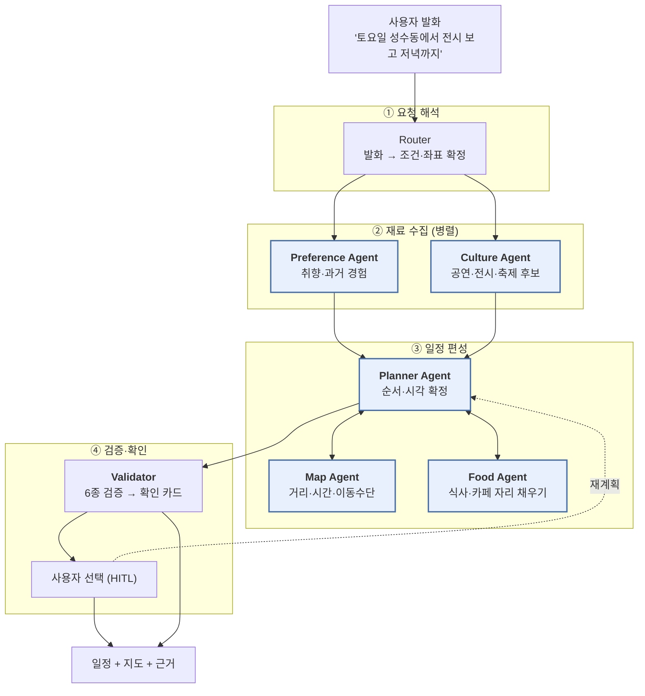

# CultureMate(MOBIDIC) 요구사항 명세서

> **멀티에이전트 기반 지도 연계 문화생활 큐레이션 서비스**
> v0.2 (MVP) · 이 문서는 **실제 구현된 코드를 근거로** 작성했다.
> 설계 의도는 `ARCHITECTURE.md`, 코드 흐름은 `STRUCTURE.md`,
> **기능별 소스 위치는 [FUNCTIONAL_MAP.md](FUNCTIONAL_MAP.md)** 참고.
> **기획안이 무엇을 약속했는지는 [PLANNING.md](PLANNING.md)** — 원문 정리와 구현 대조표.

> **서비스명은 MOBIDIC, 코드 식별자는 `culturemate`.** 둘은 같은 것을 가리킨다.
> 패키지·컨테이너·DB 볼륨 이름을 바꾸면 배포가 통째로 움직이므로 소스 쪽은 그대로 둔다.

---

## 0. 한 문장 정의

> **여러 전문 AI 에이전트가 협력하여, 개인의 과거 경험을 근거로
> 실제로 갈 수 있는 하루 문화생활 일정을 만드는 시스템.**

"추천 서비스"와 갈리는 지점은 두 가지다.

| | 일반 추천 서비스 | CultureMate |
|---|---|---|
| 결과물 | 장소 목록 | **시각·이동수단·동선이 확정된 일정** |
| 개인화 근거 | 별점·클릭 | **방문 기록 + 일정 수정 행동**(거절 기록 포함) |

---

## 1. 멀티에이전트 협업 구조

단순히 Agent를 나열하지 않고 **역할 분담과 데이터 흐름**으로 정의한다.
각 Agent는 자기 산출물을 공유 State에 쌓고, 다음 Agent는 그 State를 읽는다.

> **여기서는 5-Agent 로 묶어 설명한다.** 설계 문서는 같은 것을 **9종**으로 더 잘게 나눈다 —
> 기준은 «기능이 다른가»가 아니라 «따로 실패할 수 있는가»다. 아래 ①~⑤ 와
> `Router` · `Verifier` · `Memory` 를 합치면 9종이 되고, 그 도출 근거와 대응표는
> [AGENT_ROLES.md §1.2](AGENT_ROLES.md) 에 있다. **두 문서는 같은 구현을 다른 입도로 본 것이다.**



**협업의 핵심은 순서다.** Preference Agent가 Culture Agent와 **병렬**로 먼저 돌아,
후보가 만들어지는 시점에 이미 취향 점수가 준비돼 있다. 추천 후에 취향을 반영하면
이미 정해진 목록을 재정렬하는 것에 그치지만, 먼저 돌면 **무엇을 찾을지 자체**가 달라진다.

### 1.1 Agent별 명세

#### ① Preference Agent — 취향을 학습한다

| | |
|---|---|
| **역할** | 과거 방문 기록과 일정 수정 행동에서 개인 취향을 추출해 후보 점수에 반영 |
| **입력** | `user_id`, 현재 조건(`TripConditions`) |
| **출력** | `TasteProfile`, `archive_hits[]`, `advisories[]`(경고 카드) |
| **구현** | `app/graph/subgraphs/archive.py`, `app/memory/{retriever,profile,writer}.py` |
| **저장소** | `visits` · `plan_edits` · `experience_embeddings`(pgvector) · `taste_profiles` |

**학습 신호 두 가지**

```
① 방문 기록   → rebuild_profile()      선호 카테고리·실내외 편향·평균 체류
② 수정 행동   → extract_edit_signals() 삭제 1.0 · 교체 0.9 · 체류변경 0.7 · 순서 0.5
```

별점은 사후 합리화가 섞이지만 **수정 행동은 그 순간의 실제 선택**이다.
사용자가 지운 장소가 다음에 또 올라오지 않는 이유가 여기 있다.

**프로필이 일정에 개입하는 두 지점**

| 값 | 쓰이는 곳 | 방식 |
|---|---|---|
| `preferred_categories` · `indoor_bias` | 후보 점수 | `final_score = 0.6×relevance + 0.4×personal_score` |
| `avg_dwell_min` | 체류시간 | 사용자가 말하지 않았을 때만 배율 보정 (`×avg/60`, 0.7~1.6 상한) |

체류 보정은 **개별 값을 갈아끼우지 않고 전체에 같은 배율을 곱한다.** 미술관이 카페보다
오래 걸린다는 건 이 사용자가 오래 머무는 편이라는 사실과 별개이므로, 장소별 상대 순서는
그대로 둔다. 배율에 상한을 두는 이유는 기록이 몇 건뿐일 때 평균이 20분이나 200분으로
튀기 때문이다 — 그대로 곱하면 하루가 두 곳으로 줄거나 스무 곳으로 늘어난다.

**순서가 중요하다.** 사용자가 "장소마다 1시간씩"이라고 말했으면 그 값이 이긴다.
개인 평균이 뒤에 오면 사용자가 방금 말한 조건이 조용히 덮인다.

**검색은 3개 facet 병렬**(단일 질의로는 세 종류 이웃을 동시에 못 잡는다):

| facet | 잡는 것 |
|---|---|
| `similar_place` | 비슷한 장소·지역·카테고리 |
| `context_match` | 동행자·이동수단·계절이 비슷했던 상황 |
| `friction_edit` | 불편했던 경험과 그때 한 수정 |

#### ② Culture Agent — 문화 콘텐츠를 모은다

| | |
|---|---|
| **역할** | 공연·전시·축제·상시 문화공간 후보를 4개 소스에서 병렬 수집하고 공식정보로 검증 |
| **입력** | 조건(지역·날짜·관심사·좌표) |
| **출력** | `candidates[]`, `verifications[]`, `place_diffs[]`, `evidence[]` |
| **구현** | `app/graph/subgraphs/discovery.py`, `app/tools/{culture_api,websearch,local_catalog}.py` |

```
search_catalog    내장 카탈로그 (외부 API 없이 즉시 응답 — 바닥을 받친다)
search_events     공공 문화데이터 (기간형 행사)
search_always_on  상시 문화공간
search_web        Tavily 웹검색
        └→ normalize → verify → classify
```

**규칙 — 좌표가 없으면 후보가 아니다.** 이름이 아니라 좌표가 자격이다.
이 관문이 없으면 `8월 서울 전시회 추천<BEST5>` 같은 블로그 글 제목이 장소로 일정에 들어간다.
지도에 찍히지도, 이동시간이 계산되지도 않는데 사용자에게는 갈 수 있는 곳처럼 보인다.

**검증 3분류**: `verified`(공식 출처 일치) / `needs_check`(정보 부족 → 0.8배 감점 후 '확인 필요' 표시) /
`excluded`(불일치·종료 → 제외). `needs_check`를 버리지 않는 게 중요하다 —
소규모 공방·독립서점은 공식 정보가 원래 부실하고, 전부 떨구면 상시 문화공간 추천이 사라진다.

#### ③ Food Agent — 식사·카페 자리를 채운다

| | |
|---|---|
| **역할** | 식사 시간대를 먼저 확보하고, 남는 빈틈을 주변 식당·카페로 채움 |
| **입력** | 편성 중인 일정, 빈틈(`Gap`), 앵커 좌표 |
| **출력** | `nearby[]`, 일정에 삽입된 식사·카페 항목 |
| **구현** | `itinerary/` — `placement._meal_slot()` · `gaps.{detect_gaps,nearby_search,fill_gaps}()` |

```python
MEAL_WINDOWS = ((11:30, 13:30, "meal"), (17:30, 19:30, "meal"))
```

**식사는 시간대가 정해져 있으므로 자리를 먼저 잡는다.** 나중에 끼워 넣으면
문화 일정이 하루를 꽉 채워 정작 사용자가 말한 식사가 빠진다.

**빈틈 탐지 기준** — 유휴 40분 이상, 종료 후 잔여 60분 이상.
반경은 남은 시간에 비례한다(60분 미만 500m, 이상 1,200m). "가면 못 돌아오는 추천"을 막는다.

#### ④ Map Agent — 현실적인 동선을 만든다

| | |
|---|---|
| **역할** | 구간별 실제 이동시간을 재고 최적 이동수단을 고름 |
| **입력** | 좌표쌍, 선호 이동수단, 도착지 주차 사정 |
| **출력** | 구간 소요시간·수단·환승수, `travel_matrix`, `map_path` |
| **구현** | `app/tools/maps.py`, `app/tools/routing.py`, `itinerary._best_leg()` |

**무료 경로 API 3종을 수단별로 나눠 쓴다.**

| 수단 | 제공자 | 비고 |
|---|---|---|
| 자동차 | NAVER Directions 5/15 | 자동차 전용 |
| 도보·자전거 | OpenRouteService | Matrix로 N×N을 1콜에 |
| 지하철·버스 | ODsay LAB | `SearchPathType` 1=지하철 2=버스 |

측정 불가 시 직선거리 추정으로 내려가되 **추정임을 표시한다**(`(추정)`).

```python
FALLBACK_SPEED = {"walk": 4.5, "bike": 14.0, "bus": 14.0, "subway": 22.0, "car": 22.0}  # km/h
FIXED_OVERHEAD = {"bus": 8, "subway": 7}   # 대기·환승
DETOUR_FACTOR  = 1.35                      # 직선거리 → 실제 도로거리
```

**최단루트는 시간만 보지 않는다.** 시간만 재면 늘 자동차가 이긴다.
경로 API가 알려주지 않는 비용을 시간으로 환산해 더한다.

```python
PARKING_PENALTY_MIN  = {"none": 15, "nearby": 8, "paid": 3, "free": 0, "unknown": 5}
WALK_PREFERENCE_MIN  = 5   # 5분 차이면 걷는 게 낫다 (기다림도 환승도 없다)
TRANSFER_PENALTY_MIN = 4   # 환승 1회의 체감 부담
```

**규칙 — 사용자가 명시한 수단은 절대 바꾸지 않는다.** 수단을 섞는 건 '최단루트'를 골랐을 때뿐이다.
"도보로 짜줘"라고 했는데 지하철 아이콘이 뜨면 그 계획은 실행할 수 없다.

#### ⑤ Planner Agent — 하루를 완성한다

| | |
|---|---|
| **역할** | 앞선 Agent들의 결과를 종합해 순서·시각·체류시간을 확정 |
| **입력** | 후보, 취향, 좌표·이동행렬, 운영시간, 날씨 |
| **출력** | `Itinerary`(항목별 도착·출발·이동수단·선택 이유) |
| **구현** | `app/graph/subgraphs/itinerary/` — `context.assemble_constraints()` → `schedule.schedule()` |

**스케줄링은 LLM이 아니라 결정론적 코드가 한다.** LLM에게 시각 계산을 맡기면
이동시간과 운영시간을 지어낸다. 재현 가능해야 같은 조건에서 같은 일정이 나온다.

```
score(c) = final_score(c) − travel_min/120 + (10 if 사용자 확정 장소 else 0)
제약      depart ≤ day_end  ∧  운영시간 내  ∧  휴관일 아님
```

`+10`은 사용자가 "유지"를 선택한 장소가 재계획 때 밀려나지 않게 하는 잠금이다.
**사용자 결정을 뒤집지 않는다는 원칙을 점수 함수 안에 박아 넣었다.**

편성 순서:

```
① _meal_slot()      식사 자리 선점
② _apply_dwell()    체류시간 — 말했으면 그 범위, 아니면 과거 평균으로 보정 (상대 순서 보존)
③ _best_leg() ×N    구간별 이동수단 결정
④ _measure_legs()   실측 (예산 허용 범위 안에서)
⑤ _reflow()         측정 결과로 시계를 다시 흘린다
⑥ _reserve_to_dest() 도착지까지 갈 시간 확보
```

#### ⑥ (차별화) Validator + HITL — AI가 임의로 바꾸지 않는다

5개 Agent 위에 **검증층**을 하나 더 뒀다. 이것이 캡스톤에서 가장 방어하기 좋은 부분이다.

```
START → ⟨병렬 6종⟩ check_hours · check_travel · check_overlap
                   check_weather · check_revisit · check_friction
      → triage → build_confirm_cards → interrupt() → 사용자 선택
```

`auto_fixable=False` **이면서** `severity ≥ 2`인 이슈만 사용자에게 올린다.
`interrupt()`로 그래프를 **실제로 정지**시키고 선택을 받은 뒤 정확히 그 지점부터 재개한다.

카드에는 항상 다섯 가지가 들어간다 — **(1) 발견된 문제 (2) 관련 기록·공식정보
(3) 일정에 미치는 영향 (4) 변경 이유 (5) 선택지**. 첫 선택지는 **항상 "그대로 진행"**이다.
변경이 기본값이면 사용자는 사실상 자동 변경을 승인하게 된다.

---

## 2. 핵심 기능 6가지

Wanderlog의 여행 일정 UX를 문화생활 도메인으로 옮기되, **F5·F6이 차별점이다.**
F1~F6이 모두 구현돼 있다 — **F6(캘린더)은 2026-08-17 에 닫혔다**(UR-28 · FR-27 · FR-28).
상태를 섞어 적지 않는다.

### F1. 날짜별 일정 자동 생성

한 번의 발화로 시각이 확정된 하루를 만든다.

- 발화에서 날짜·시각·지역·출발지·도착지·체류시간·개수·이동수단·동행자를 추출
- 말하지 않은 값은 채우되 **채운 티를 낸다** — 시스템이 정한 시각은 화면 칩에 올리지 않는다
- 고정 약속(`09시에 강남역 메가박스`)은 시각을 지키고, 그 앞이 밀리면 `앞 일정이 길어 N분 늦을 수 있음`을 단다
- 하루 끝을 넘기는 항목은 **버린다** — 갈 수 없는 일정을 남기지 않는다

> **입력 예시**
> `"양재역 09시에 출발해서 강남 전시 3곳이랑 저녁까지, 밤 20시에 종로역 도착"`
> → 출발 09:00 양재역 / 전시 3곳 / 저녁 1곳 / 도착 20:00 종로역

### F2. 지도 기반 이동

- `Itinerary.map_path`(좌표 배열)와 구간별 소요시간을 내려주면 클라이언트가 렌더링
- 🚩 시작 · 🏁 끝 핀과 구간 라벨을 지도에 표시
- **구간마다 실제 경로 선형을 그린다** — 장소를 직선으로 잇지 않는다(F3)
- 수단이 선 모양으로 구분된다 — 도보 점선 · 지하철 굵은 실선 · **미실측 구간은 옅은 점선**
- 서버는 지도 SDK에 의존하지 않는다 — **공급자를 바꿔도 서버 계약은 그대로**
- 좌표 없는 장소는 애초에 후보가 되지 못하므로 지도에 빈 항목이 생기지 않는다

### F3. 동선 최적화 (무료 API 실측)

- 구간마다 도보/지하철/버스/자가용을 **모두 재서** 가장 나은 것을 고름(최단루트)
- 주차 사정·환승 부담·도보 선호를 시간으로 환산해 합산 (§1.1 ④)
- greedy nearest-feasible — 장소 3~6개 규모에서 최적해와 거의 차이가 없고 **재현 가능**
- 도착지를 지정하면 하루가 끝나갈수록 그쪽으로 끌어당긴다(가중치가 시간의 제곱으로 커져 오전엔 영향 없음)
- 이동수단만 바꿔 다시 계산하는 `POST /reroute`는 전체 그래프를 안 돌고 **2~3초**에 끝난다

**실제 경로 선형까지 그린다.** 세 제공자가 수단별로 나눠 준다 — 도보·자전거는 ORS,
자동차는 NAVER, 지하철·버스는 ODsay `loadLane`. 셋 다 무료 티어다.

> **2단계로 나눈 이유** — 응답 예산 15초에는 탐색·검증·편성이 다 들어가야 해서
> 구간 실측이 잘린다. 그래서 첫 응답은 추정으로 빠르게 내보내고(`POST /chat`),
> 화면이 그려진 뒤 `POST /threads/{id}/routes` 가 실제 좌표를 채운다.
> **사용자는 기다리지 않는다** — 이미 일정을 보고 있고 선만 뒤늦게 정확해진다.
> 실패해도 조용히 넘어간다. 선이 직선으로 남을 뿐 일정은 이미 손에 있다.

구간당 좌표가 수백 개라 120점까지 솎아 모바일 페이로드를 줄인다(양 끝점은 보존).

### F4. 문화·공연·축제·맛집 자동 연결

- 공연·전시·축제: 공공 문화데이터 + 상시 문화공간 + 내장 카탈로그 + 웹검색 (4소스 병렬)
- 맛집·카페: 식사 시간대 선점 + 빈틈 자동 채우기 (§1.1 ③)
- 장소 종류는 `event · venue · food · cafe · shop · park · other` 7종으로 정규화
- 같은 장소가 여러 소스에서 오면 **정보가 더 풍부한 쪽**을 남기고 점수는 max로 병합

### F5. 아카이브 기반 개인화 + 사용자 확인 ★차별화

앞의 4개는 Wanderlog도 한다. **이 항목이 이 프로젝트를 다른 것으로 만든다.**

- 과거 방문·불편 기록이 **추천 전에** 개입한다(사후 필터가 아니다)
- "작년에 주차 때문에 고생한 곳"이 다시 올라오면 **경고 카드 + 대안**을 함께 제시
- 재방문 장소는 마지막 방문 시점 스냅샷과 현재 공식정보를 비교해 **달라진 점 8개 필드**를 알림
- 사용자가 지우거나 바꾼 행동을 학습해 다음 추천에 반영
- AI는 **바꾸지 않고 묻는다** — `interrupt()`로 정지하고 선택을 받는다

### F6. 캘린더로 일정 확인 ★핵심 · ✅ 구현 (2026-08-17)

**만든 일정을 날짜로 다시 연다.** 그전에는 스레드가 살아 있는 동안에만 일정이 보였고,
앱을 닫으면 그날의 일정으로 돌아갈 길이 없었다. 기획안 4.3의 선순환
(탐색 → 일정 → 동선 → **기록** → 분석)은 «다시 열기»가 있어야 04에 도달한다 — 그 고리를 캘린더가 닫는다.

- **월/주 캘린더**에 확정 일정을 날짜별로 표시한다 — 지난 일정과 예정 일정을 한 화면에서
- 날짜를 누르면 그날의 타임라인·지도·판단 근거가 그대로 열린다(저장된 `Itinerary` 전체)
- **기록이 없는 지난 일정에는 «기록 남기기»를 띄운다** — 아카이브 유입의 주 경로가 여기다
- 기간형 행사는 **종료일이 가까울수록 앞으로 당겨 보여준다**(«20일 남음»과 같은 축)
- 캘린더는 **읽기 화면이다.** 일정 변경은 기존 재계획 경로(`POST /chat` · `POST /reroute`)를
  그대로 쓴다 — 두 번째 편집 경로를 만들면 `plan_edits` 학습 신호가 두 갈래로 갈린다

> **데이터는 이미 쌓이고 있다.** `plans(id, user_id, plan_date, version, status, payload)` 와
> `idx_plans_user_date` 가 스키마에 있고, `nodes.persist` 가 `repo.save_itinerary()` 로
> 매 일정을 저장한다. `repo.load_active_itinerary(user_id, day)` 도 이미 날짜로 조회한다.
> **빠진 것은 «기간으로 목록을 읽는 엔드포인트»와 «화면» 둘뿐이다** — 새 저장소도, 새
> 마이그레이션도 필요 없다. → FR-27 · FR-28 · UR-28

---

## 3. 기능 요구사항 (FR)

| ID | 요구사항 | 담당 Agent | 구현 위치 | 상태 |
|---|---|---|---|:--:|
| FR-01 | 자연어 발화에서 일정 조건을 구조화한다 | Router | `graph/router/` | ✅ |
| FR-02 | 출발지·도착지·지역을 좌표로 확정한다 | Router | `router._resolve_places` | ✅ |
| FR-03 | 요청 유형에 따라 필요한 Agent만 실행한다 | Router | `router.fan_out` (7종 라우트) | ✅ |
| FR-04 | 과거 방문 기록을 검색해 취향을 산출한다 | Preference | `subgraphs/archive.py` | ✅ |
| FR-05 | 일정 수정 행동을 학습해 프로필에 반영한다 | Preference | `memory/profile.apply_edit_signals` + `plan_edits` 재집계(FR-30) | ✅ |
| FR-06 | 공연·전시·축제 후보를 다중 소스에서 수집한다 | Culture | `subgraphs/discovery.py` | ✅ |
| FR-07 | 후보의 공식정보를 검증해 3분류한다 | Culture | `tools/verify.py` | ✅ |
| FR-08 | 재방문 장소의 변경사항을 비교한다 | Culture | `verify.diff_against_snapshot` | ✅ |
| FR-09 | 식사 시간대를 확보하고 맛집을 배치한다 | Food | `itinerary._meal_slot` | ✅ |
| FR-10 | 일정 빈틈을 주변 장소로 채운다 | Food | `detect_gaps → fill_gaps` | ✅ |
| FR-11 | 구간별 실제 이동시간을 측정한다 | Map | `tools/{maps,routing}.py` | ✅ |
| FR-12 | 구간마다 최적 이동수단을 선택한다 | Map | `itinerary._best_leg` | ✅ |
| FR-13 | 날짜별 시각이 확정된 일정을 생성한다 | Planner | `itinerary.schedule` | ✅ |
| FR-14 | 실측 결과로 전체 시각을 재계산한다 | Planner | `itinerary._reflow` | ✅ |
| FR-15 | 이동수단 변경 시 동선을 재계산한다 | Map/Planner | `POST /reroute` | ✅ |
| FR-16 | 일정 이슈를 6종 병렬 검증한다 | Validator | `subgraphs/validation.py` | ✅ |
| FR-17 | 사용자 확인이 필요한 항목만 카드로 만든다 | Validator | `triage → build_confirm_cards` | ✅ |
| FR-18 | 그래프를 정지하고 사용자 선택을 받는다 | HITL | `nodes.human_review` (`interrupt`) | ✅ |
| FR-19 | 선택을 반영해 재계획한다 | HITL | `nodes.after_review` (최대 2회) | ✅ |
| FR-20 | 모든 판단에 근거를 남기고 조회할 수 있다 | 전체 | `Evidence` + `GET /threads/{id}/evidence/{eid}` | ✅ |
| FR-21 | 방문 기록을 저장하고 프로필을 갱신한다 | Preference | `POST /visits` | ✅ |
| FR-22 | 취향 리포트를 제공한다 | Preference | `GET /report/{user_id}` | ✅ |
| FR-23 | 장소를 컬렉션으로 저장·관리한다 | — | `POST/DELETE /collections` | ✅ |
| FR-24 | 방문 기록에서 큐레이션 지도를 만든다 | Preference | `memory/curation.py` | ✅ |
| FR-25 | 카드 스와이프로 초기 취향을 등록한다 | Preference | `POST /preferences/cards` → `profile.apply_preference_cards` | ✅ |
| FR-26 | 영화 상영 시간표를 연동한다 | Culture | 영화관은 `venue`로만 취급 | ⬜ |
| FR-27 | 기간으로 확정 일정 목록을 조회한다 | — | `GET /plans/{user_id}?from=&to=` (요약만) | ✅ |
| FR-28 | 캘린더에서 날짜를 골라 그날 일정을 연다 | — | `(tabs)/calendar.tsx` + `GET /plans/detail/{id}` | ✅ |
| FR-29 | 과거 불편 기록을 일정 편성 전에 경고로 승격한다 | Validator | `validation.check_friction` | ✅ |
| FR-30 | 일정 수정 행동을 `plan_edits`에 영속화한다 | Preference | `nodes.persist` → `repo.save_plan_edits` → `profile.rebuild_profile` | ✅ |
| FR-31 | 도보·환승 상한을 기록에서 산출해 개인화한다 | Planner | 현재 전역 상수 | ⬜ |
| FR-32 | 저장 목록에서 바로 일정을 만든다 | — | `user_collections` → 일정 생성 경로 없음 | ⬜ |
| FR-33 | **종류별 개수를 해석해 그만큼만 배치한다** | Router/Planner | `router._detect_kind_quota` → `itinerary.schedule` | ✅ |

✅ 구현 완료 · ⬜ 미구현

> **FR-25~FR-32는 의도적으로 '미구현'으로 표기했다.** 명세서에 있는데 코드에 없으면
> 심사에서 가장 먼저 드러난다. 콜드 스타트는 카드 스와이프 대신 **내장 카탈로그 + 규칙 폴백**으로
> 대응하고 있고, 영화는 상영 시간표 API가 유료라 Phase 2로 미뤘다.
> **FR-27~FR-32는 기획안 대조에서 새로 드러난 항목**이다 — 근거는 [PLANNING.md §7·§8](PLANNING.md).
>
> **FR-33 은 «문화 2개 + 디저트 3개» 처럼 종류별로 개수를 말한 경우다**(2026-08-17).
> 예전에는 앞 숫자 하나만 잡아 `stop_count=2` 로 끝났고, 문화 2곳이 배치된 뒤 빈틈
> 채우기가 카페를 여섯 곳 밀어 넣었다. 사람이 개수를 말하는 단위(**그룹**)와 저장 단위
> (`PlaceKind` 7종)가 달라서 생긴 일이라, `schemas.KIND_GROUPS` 로 둘을 잇고
> `TripConditions.kind_quota` 에 배분을 싣는다. **새 종류는 그 표 한 줄과 라우터
> 키워드 한 줄이면 늘어난다** — 스케줄러·빈틈채우기는 그룹 이름만 본다.

### 3.5 사용자 요구사항(UR) 전량 추적표

FR이 «코드가 무엇을 하는가»라면 UR은 «사용자가 무엇을 원하는가»다.
번호는 원 기획안에서 시작해 [TEST.md §7](TEST.md)의 검증 결과와
[PLANNING.md §7](PLANNING.md)의 기획안 대조로 이어졌다. **비어 있는 번호는 없다.**

#### 분류 축 — 기획안 4.3의 선순환을 그대로 쓴다

새 요구사항이 생겼을 때 **어디에 붙는지**를 번호가 아니라 **단계**가 말하게 한다.
번호는 시간 순서(언제 제안됐나)일 뿐이고, 단계가 의미 축(무엇을 고치는 일인가)이다.

```
① 탐색 ──→ ② 일정 ──→ ③ 동선 ──→ ④ 기록 ──→ ⑤ 분석 ──┐
   ▲                                                    │
   └────────────────────────────────────────────────────┘
                    ⓧ 횡단 — 신뢰·근거·개인정보·운영
```

이 축을 쓰는 이유는 [PLANNING.md §4.3](PLANNING.md)이 서비스의 성립 조건으로
«다섯 단계가 한 앱 안에서 끊기지 않아야 한다»를 들었기 때문이다. **어느 단계에
요구사항이 몰려 있고 어디가 비어 있는지**가 곧 기획 대비 진척도가 된다.

#### 번호 규칙 (확장성)

1. **한 번 부여한 번호는 바뀌지 않는다.** 문서 6개·소스 주석·테스트가 서로를
   번호로 가리키므로, 재배치하면 그 참조가 전부 거짓이 된다.
2. **신규는 항상 «현재 최대 + 1».** 단계별로 번호 구간을 예약하지 않는다 —
   구간을 잡으면 한 단계가 먼저 소진돼 결국 규칙을 어기게 된다.
3. **제외된 항목도 번호를 비우지 않는다**(⬛로 남긴다). 비우면 나중에 재사용돼
   같은 번호가 두 가지를 뜻하게 된다.
4. **다음 번호는 UR-41 · FR-34** 이다.

| UR | 단계 | 기능명 | 상태 | 구현 위치 · 근거 |
|:--:|:--:|---|:--:|---|
| UR-01 | ⑤ | 개인 취향 등록(카드) | ✅ | `repo.save_preference_cards` → `profile.apply_preference_cards` → `taste-cards.tsx` (FR-25). 콜드 스타트에서 `personal_score` 가 0.5 고정을 벗어난다 |
| UR-02 | ① | 문화생활 조건 입력 | ✅ | `router.classify` → `TripConditions` |
| UR-03 | ① | 문화 콘텐츠 통합 탐색 | ✅ | `discovery` 4소스 병렬 |
| UR-04 | ⓧ | 신뢰 가능한 정보 확인 | ✅ | `tools/verify.py` 3분류 + 재방문 diff |
| UR-05 | ② | 맞춤 일정 자동 생성 | ✅ | `itinerary.schedule` |
| UR-06 | ③ | 지도 기반 동선 확인 | ✅ | `map_path` + `tools/{maps,routing}.py` |
| UR-07 | ② | 날씨 기반 일정 추천 | ✅ | `ctx_weather` → `indoor_alternatives` |
| UR-08 | ② | 주변 장소 추천 | ✅ | `detect_gaps → nearby_search → fill_gaps` |
| UR-09 | ④ | 일정 직접 수정 | ✅ | 재계획·수단변경 + **확정 카드·diff 를 `plan_edits` 에 기록**하고 재집계가 되읽는다 (FR-30) |
| UR-10 | ④ | 개인 아카이브 관리 | ✅ | `POST /visits` · facet 3종 · RRF · 리랭크 |
| UR-11 | ① | 과거 경험 기반 개인화 | ◐ | `personal_score`·facet 검색은 유지, **경고 카드 생성 제거** |
| UR-12 | ② | 경험 기반 주의 알림 | ⬛ | 제외 — `validation.check_archive` 삭제 |
| UR-13 | ⓧ | 대안 확인 및 선택 (HITL) | ✅ | `interrupt()` · 첫 선택지 «그대로» 고정 |
| UR-14 | ⓧ | AI 판단 근거 확인 | ✅ | `Evidence` 누적 + 지연 로드 |
| UR-15 | ⑤ | 취향 리포트 | ✅ | `GET /report/{user_id}` + 모바일 취향 탭 (대화 경로만 제거) |
| UR-16 | ⓧ | 일정 이미지 공유 | ⬛ | 제외 — 미구현 상태로 범위 밖 |
| UR-17 | ⓧ | 개인정보 통제 | ✅ | `ON DELETE CASCADE` 전면 |
| **UR-40** | ② | **과거 불편의 선제 경고** | ✅ | 기획안 2.1-②의 핵심 화면. `past_friction` **생산자만** 되살리면 된다 (FR-29). UR-11·UR-12 를 대체한다 — 번호는 재사용하지 않는다 |
| **UR-18** | ① | **행정구역 경계 기반 필터** | ✅ | `tools/region.py` 가 지오코딩·주소에서 시·도를 읽고 `discovery.normalize` 가 다른 시·도를 제외한다. 말한 구(區)는 가점(`REGION_BONUS`)으로 앞에 온다. 거리 상한(`MAX_ANCHOR_KM`)은 **행정구역을 모르는 후보용 보조 수단**으로 남았다 (TEST D-01) |
| UR-19 | ① | 장소 데이터 자동 보강 | ⬜ | TEST D-01·D-03 |
| UR-20 | ① | 결과 부족 시 명시 | ⬜ | TEST D-03 |
| UR-21 | ⓧ | 응답 시간 가시화 | ⬜ | TEST D-04 |
| UR-22 | ② | 일정 저장·공유 링크 | ⬜ | UR-28과 저장소를 공유한다 |
| UR-23 | ④ | 실행 후 피드백 수집 | ⬜ | UR-32와 함께 |
| UR-24 | ② | 예산(비용) 조건 | ⬜ | `travel_fare` 는 이미 있다 |
| UR-25 | ② | 동행자 유형별 일정 | ⬜ | `visits.companions` 는 이미 저장된다 |
| UR-26 | ③ | 오프라인 열람 | ⬜ | `store/storage.ts` 캐시가 기반 |
| UR-27 | ② | 대안 일정 비교 | ⬜ | — |
| **UR-28** | ②④ | **캘린더로 일정 확인** ★핵심 | ✅ | **F6.** `repo.list_plans` → `GET /plans/{user_id}` → `(tabs)/calendar.tsx` (FR-27·FR-28) |
| UR-29 | ① | 남은 기간 배지 · «오늘 열려요» 필터 | ⬜ | 기획안 2.4-① |
| UR-30 | ①② | 저장 목록에서 일정 만들기 | ⬜ | 기획안 2.4-② (FR-32) |
| UR-31 | ① | 3지 반응(기대돼요/가봤어요/관심 없어요) | ✅ | 기획안 2.4-③ · `verdict` 4값 + `experienced` 조합을 `taste-cards.tsx` 가 3지로 낸다 |
| UR-32 | ④ | 구조화 기록 입력(태그·사진·재방문 의사) | ◐ | 기획안 2.1-①·4.1 · `POST /visits` 는 있으나 화면이 얇고 자동 유도가 없다 |
| UR-33 | ⓧ | 근거 3색 규약 · 확인 시각 노출 | ◐ | 기획안 3.1 색 구분 · 데이터는 있으나 화면 계약이 없다 |
| UR-34 | ⑤ | «추천에 적용된 규칙» 칩 · 끄기 | ⬜ | 기획안 2.3-③ |
| UR-35 | ⑤ | 파생 제약 자동 산출(도보·환승 상한) | ◐ | 기획안 3.2 · 체류시간만 개인화됨 (FR-31) |
| UR-36 | ③ | 현장 진행 표시 · 조기 종료 감지 | ◐ | 기획안 2.5-③ · `gap_fill` 라우트는 있으나 감지 트리거가 없다 |
| UR-37 | ③ | 하루 이동 요약 · 정렬 기준 선택 · 편의시설 | ⬜ | 기획안 2.2-②·2.5-① |
| UR-38 | ⑤ | 뱃지 · 맞춤 미션 | ⬜ | 기획안 4.3 «05 분석 → 01 탐색» 되돌림 |
| UR-39 | ② | 예약·티켓 연결 | ⬜ | 기획안 5.2 · Phase 3 |

✅ 구현 완료 · ◐ 부분 · ⬜ 미구현 · ⬛ 범위에서 제외

**UR-28을 가장 먼저 하는 이유** — 남은 항목 중 **필요한 것이 이미 다 있는 유일한 기능**이다.
새 테이블도, 새 외부 API도, 새 모델도 없다. 그리고 캘린더가 없으면 UR-32(기록)·UR-38(뱃지)의
진입점이 함께 막힌다 — 선순환이 «04 기록» 앞에서 끊긴 채로 남는다.

---

## 4. 비기능 요구사항 (NFR)

| ID | 항목 | 기준 | 구현 방식 |
|---|---|---|---|
| NFR-01 | 응답 시간 | 일정 생성 15초 이내 | **시간 예산제** — 단계마다 비용을 매기고 `Budget.allows()`로 미리 판단 |
| NFR-02 | 응답 보장 | 무엇을 건너뛰든 답변은 나온다 | `COST_COMPOSE=2.5`를 항상 예약 |
| NFR-03 | 장애 격리 | 외부 API 1개가 죽어도 그래프는 안 멈춘다 | 전 호출 `safe_call`(타임아웃 + 기본값) |
| NFR-04 | LLM 의존 최소화 | LLM이 실패해도 결과가 나온다 | 라우터·facet·판정·카드 전 지점 규칙 폴백 |
| NFR-05 | 재현성 | 같은 조건 → 같은 일정 | 시각·거리 계산은 결정론적 코드만 |
| NFR-06 | 세션 복원 | 앱이 꺼져도 HITL이 이어진다 | PostgresSaver 체크포인터 + `thread_id` |
| NFR-07 | 외부 쿼터 보호 | 후보 60개 중 상위 12개만 검증 | `CANDIDATE_POOL=60` · `VERIFY_TOP_K=12` · 동시 8 |
| NFR-08 | 캐시 | 반복 조회 절감 | 지오코딩 24h · 경로 30m~1h · 웹검색 15m |
| NFR-09 | 모바일 페이로드 | 근거 원문은 지연 로드 | 목록엔 `evidence_ids`만 |
| NFR-10 | 네트워크 단절 내성 | RN `fetch` 스트리밍 미지원 대응 | `react-native-sse` + `/chat/sync` 폴백 |
| NFR-11 | 개인정보 | 공유 시 위치·메모 제외 | `ON DELETE CASCADE` 전면, 캡처 뷰에서 `origin` 제외 |
| NFR-12 | 역직렬화 안전성 | 체크포인트 화이트리스트 | `JsonPlusSerializer(allowed_msgpack_modules=...)` |

---

## 5. 외부 API 인벤토리

**데이터·경로 API는 전부 무료 티어다.** 유료를 섞으면 배포에 고정비가 생기고,
키가 없는 심사·데모 환경에서 그 구간이 통째로 비어 일정이 성립하지 않는다.
**예외는 채팅 LLM 하나**뿐이며, 그 이유와 되돌리는 법은 §5.3에 적었다.

| # | 용도 | 제공자 | 비용 | 없으면 | 담당 Agent |
|:--:|---|---|---|---|---|
| 1 | LLM (chat) | OpenAI `gpt-4o-mini` — router·planner·fast만 | **유료** | 규칙 기반 폴백으로 동작 | 전체 |
| 1-b | LLM (writer) | NVIDIA NIM `llama-3.1-8b` | 무료 | 정형 문장으로 폴백 | Itinerary |
| 2 | 임베딩 | NVIDIA NIM | 무료 | 아카이브 검색 불가 | Preference |
| 3 | 리랭크 | NVIDIA NIM | 무료 | RRF 결과를 그대로 사용 | Preference |
| 4 | 기간형 행사 | KCISA `CNV_060` | 무료 · API별 신청 | 웹검색으로 대체 | Culture |
| 5 | 문화시설 | 공공데이터포털 `cultureartspaces` | 무료 · 자동승인 10,000/일 | 네이버 지역검색으로 대체 | Culture |
| 6 | 날씨 | 기상청 API허브 | 무료 | 악천후 경고 없음 | Planner |
| 7 | 지오코딩 | NCP Maps | 무료 티어 | **좌표 없음 → 일정 불가** | Map |
| 8 | 자동차 경로 | NCP Directions 5/15 | 무료 티어 | 직선거리 추정 | Map |
| 9 | 도보·자전거 경로 | OpenRouteService | 2,500건/일 · 40,000건/월 | 직선거리 추정 | Map |
| 10 | 지하철·버스 경로 | ODsay LAB | 1,000건/일 | 직선거리 추정 | Map |
| 10b | 노선 선형(지도 선) | ODsay `loadLane` | 위와 같은 쿼터 | 지도에 직선 | Map |
| 11 | 주변 장소 (1순위) | **카카오 Local** | 무료 100,000/일 | NAVER 지역검색으로 폴백 | Food · Culture |
| 11-b | 주변 장소 (2순위) | NAVER 검색 API | 무료 | 식당·카페 채우기 비어 있음 | Food · Culture |
| 12 | 웹검색 (1순위) | Tavily | 무료 티어 | Exa로 넘어감 | Culture |
| 13 | 웹검색 (2순위) | Exa | 무료 티어 | 공식정보 검증 축소 | Culture |

### 5.0 문화 데이터 두 종은 발급처가 다르다

같은 '문화 데이터'인데 **행사와 시설이 서로 다른 포털**에서 온다. 키도 따로다.

| | 발급처 | 엔드포인트 | 키 |
|---|---|---|---|
| 기간형 행사 | **KCISA**(문화공공데이터광장) | `api.kcisa.kr/openapi/CNV_060/request` | `CULTURE_API_KEY` |
| 문화시설 | **공공데이터포털** | `apis.data.go.kr/B553457/nopenapi/rest/cultureartspaces` | `DATA_GO_KR_KEY` |

**한 칸에 몰아넣으면 안 된다.** 행사를 KCISA로 옮기면서 `CULTURE_API_KEY`에 KCISA 키가
들어가는데, 시설 API는 여전히 data.go.kr이라 그 키를 받으면 `code 30`으로 거부한다.
그래서 `config.portal_key` 를 따로 뒀다.

**함정 셋** — 셋 다 "응답은 정상인데 결과가 0건"으로 나타나 원인을 찾기 어렵다.

1. **시설 엔드포인트는 Base URL이다.** 오퍼레이션(`/artgallery` `/museum` `/performingplace`)을
   붙여야 한다. 안 붙이면 404가 아니라 `code 12`(서비스 없거나 폐기됨)가 돌아와,
   주소가 죽은 것처럼 보인다.
2. **`sido` 는 정식 명칭만 받는다.** `"서울"` 은 오류 없이 0건, `"서울특별시"` 라야 한다.
3. **필드명이 포털마다 다르다.** 시설은 `culName`/`culGrpName`,
   행사는 `title`/`eventSite`. 매핑을 빠뜨리면 `resultCode 00`에 581건을 받고도 후보는 0건이 된다.

> 진단은 **공공 API 응답과 폴백을 나눠서** 보고한다(`from_api` / `from_fallback`).
> 합쳐서 세면 키가 잘못돼도 초록불이 떠서, 원인을 좁힌다는 진단의 목적이 사라진다.

**KCISA는 API 단위로 활용신청한다.** 계정 키 하나로 전부 열리지 않는다 —
신청한 `CNV_060` 은 200, 신청하지 않은 `API_CCA_144` 는 401이다.

### 5.1 설계상 중요한 세 가지

**① 경로 API를 수단별로 쪼갠 이유.** NCP Directions는 자동차만 제공한다.
도보를 자동차 경로로 계산하면 골목과 보행로를 무시해 실제와 크게 어긋난다.
그래서 도보는 ORS, 대중교통은 ODsay로 나눠 받는다. 셋 다 무료 티어이므로
**"무료 네비게이션 이동시간 계산"(F3)이 실제로 성립한다.**

**②-b 주변 검색도 순차 폴백이다.** NAVER 지역검색에는 **반경 파라미터가 없다.** 그래서 기존 경로는 좌표를 주소로 되돌린 뒤 «서울 서초구 반포동 카페» 같은 키워드로 찾고 결과를 코드에서 잘라냈다 — 호출이 두 번이고, 앵커가 동(洞) 경계에 있으면 **200m 옆 가게가 목록에 아예 없다.** 카카오는 `x`·`y`·`radius` 를 서버가 받고 `distance` 를 함께 준다. 실측(서초역 3km): 미술관 10 vs 5 · 공방 10 vs 5 · 복합문화공간 10 vs 5 — 약 2배를 잡는다.

**둘을 합치지 않고 순차로 간다.** 같은 가게를 두 제공자가 다르게 표기해(«스타벅스 서초점» / «스타벅스 서초») `merge_candidates` 의 이름 키가 갈리면 같은 곳이 일정에 두 번 들어간다.

**② 웹검색은 순차 폴백이다.** 앞 제공자가 0건을 돌려주면(무료 쿼터 소진 등)
다음 제공자로 넘어간다. 키를 두 개 넣어 둔 것이 실제로 의미를 갖는 구조다.

**③ 임베딩 차원은 고정이다.** `EMBED_DIM=1024`는 `db/001_schema.sql`의
`vector(1024)`와 묶여 있다. 모델을 바꾸려면 스키마와 기존 임베딩을 함께
재생성해야 하므로, 채팅 LLM을 OpenAI로 바꿔도 **임베딩만은 NIM 무료를 유지한다.**

### 5.2 없어도 되는 것과 없으면 안 되는 것

```
필수  NVIDIA NIM        — 없으면 임베딩·리랭크가 죽어 개인화가 성립하지 않는다
      NCP Maps          — 좌표가 없으면 후보 자격 자체가 없다(§1.1 ②)

권장  ORS · ODsay       — 없으면 이동시간이 전부 '(추정)'이 된다
      기상청 · NAVER검색 — 없으면 해당 기능만 조용히 비활성

선택  문화 API          — 없으면 웹검색 + 내장 카탈로그가 대신한다
      Tavily · Exa      — 하나만 있어도 된다
```

키가 무엇이 설정됐고 실제로 응답하는지는 `GET /diagnostics?probe=true` 로 한 번에 확인한다.
**키는 `.env` 에만 둔다** — `.gitignore` 가 제외하고 있고, 저장소에는 값이 빠진
`.env.example` 만 있다.

---

### 5.3 채팅 LLM만 유료인 이유

역할별로 공급자를 나눌 수 있게 해 뒀다. `.env` 의 `MODEL_*` 앞에 접두사를 붙이면
그 역할만 다른 공급자로 간다.

```
MODEL_ROUTER=openai:gpt-4o-mini          발화 이해 — 한국어 구조화 추출
MODEL_PLANNER=openai:gpt-4o-mini         관련성 판정
MODEL_WRITER=meta/llama-3.1-8b-instruct  일정 서술 · 경고 카드 문구
MODEL_FAST=openai:gpt-4o-mini            facet 생성 · 사실 추출 · 요약
MODEL_EMBED=                             비움 → NIM 유지 (1024차원)
MODEL_RERANK=nvidia/llama-nemotron-rerank-1b-v2
```

**임베딩·리랭크는 접두사가 없으므로 전역 `LLM_BACKEND=nim` 을 따른다.**

역할을 나눈 기준은 모델 크기가 아니라 **무슨 일을 시키는가**다. 같은 모델이라도
평문 생성과 대형 스키마 구조화 출력에서 결과가 정반대로 나온다.

| 역할 | 공급자 | 실측 근거 |
|---|---|---|
| router | `openai` `gpt-4o-mini` | 4.9s. 8B 는 3.5s 로 빠르지만 `RouteDecision`(4,730자·중첩 4개)에서 출발·도착 지명을 통째로 비운다 → **정확도** 때문에 유료 |
| planner | `openai` `gpt-4o-mini` | 1.2~1.5s. archive **병렬** 구간이라 바꿔도 체감 0 → 품질 쪽을 택함 |
| writer | NIM `llama-3.1-8b` | compose 는 응답 시간의 **55%**. 4o-mini 15~17s vs 8B 3.5~5.2s. 평문 생성이라 8B 의 구조화 출력 약점이 안 나타나고, 맡는 스키마는 `AdvisoryDraft` 301자뿐 |
| fast | `openai` `gpt-4o-mini` | verify 의 사실 추출이 주 용도. 2단계라 15초 예산 밖 → 정확도 우선 |
| 임베딩 | `NVIDIAEmbeddings` **1024차원** | 0.65s. 무료 · `vector(1024)` 와 일치 |
| 리랭크 | NIM `llama-nemotron-rerank-1b-v2` | 0.45s. 무료 |

이 배선에서 1단계 응답은 **14.2~14.6초**로 NFR-01(15초)을 충족한다.

> **2026-08-18 — 이 배선이 `.env` 에 실제로 들어갔다.** 그전까지 `MODEL_*` 네 칸이
> 비어 있어 네 역할 모두 NIM 기본값으로 갔고, 그 기본값이 planner·writer 를
> `llama-3.3-70b-instruct` 로 잡았다. 그래서 compose 가 **12.3초**를 먹고 라우터 8B 가
> 출발지·시각을 비웠다(위 경고가 예고한 그대로다). 적용 후 1단계 20.2초 → 16.6초,
> compose 12.3초 → 2.0초. **임베딩은 `nvidia/llama-nemotron-embed-1b-v2`(1024차원)** 로
> 바꿨다 — 기본 2048이라 `dimensions=1024` 를 넘겨야 하고, 그 처리는
> `provider.EMBED_DIM_CONFIGURABLE` 이 한다. **2048은 선택지가 아니다** — pgvector
> HNSW 인덱스가 2000차원 상한이라 인덱스를 못 만들고 순차 스캔으로 떨어진다.

> ⚠️ **`meta/llama-3.3-70b-instruct` 는 무료 티어에서 쓸 수 없다.** 구조화 출력이
> 30~60초 걸려 라우터·writer 는 타임아웃, planner 는 44초가 나온다. 폴백만 유발한다.
>
> ⚠️ **리랭커 모델명은 카탈로그에 있어도 살아 있다는 뜻이 아니다.**
> `nv-rerankqa-mistral-4b-v3` → 404, `llama-3.2-nv-rerankqa-1b-v2` → EOL(410).
> 둘 다 `available_models` 에는 그대로 올라와 있다. 바꿀 때는 직접 호출해 볼 것.

**모델을 바꾸기 전에 반드시 재 볼 것 — `scripts/bench_models.py`.**
단, 이 스크립트의 기본 라우터 작업은 필드 2개짜리 축소 스키마라 실제보다 훨씬
빠르게 나온다(8B 0.36s / 4o-mini 0.80s). 실제 `RouteDecision` 으로는 4~5초다.

> **주의 — `langchain-openai` 가 `requirements.txt` 에 있어야 한다.**
> `provider.py` 는 백엔드를 조건부로 import 한다. 접두사만 바꾸고 패키지가 없으면
> 그 역할의 LLM 호출이 `ModuleNotFoundError` 로 전부 죽고, 폴백이 받아 주기 때문에
> **에러 없이 조용히 품질만 떨어진다.** 실제로 한동안 네 역할 전부가 규칙 폴백으로만
> 돌고 있었다. `GET /diagnostics?probe=true` 의 `llm` 프로브가 이 상태를 잡는다.

## 6. 기술 스택

| 계층 | 선택 | 근거 |
|---|---|---|
| 오케스트레이션 | LangGraph 1.2.10 | 조건부 분기 · 병렬 · 체크포인트 · `interrupt()` |
| 모델 | NVIDIA NIM (chat/embed/rerank) | `LLM_BACKEND`로 OpenAI·Anthropic 교체 가능 |
| 백엔드 | FastAPI 0.141.1 + SSE | 토큰과 interrupt 이벤트를 한 채널로 |
| 저장소 | PostgreSQL 18 + pgvector | 사실·계획·경험·벡터를 한 DB에 (조인 가능한 개인화) |
| 벡터 인덱스 | HNSW `m=16, ef_construction=64` | cosine, 하이브리드(dense + tsvector)의 한 축 |
| 클라이언트 | React Native 0.86 / Expo SDK 57 | 현장 재계획이 핵심 시나리오 |
| 경로 API | NAVER · OpenRouteService · ODsay | **전부 무료 티어** |
| 배포 | Docker Compose | `docker compose up -d --build` 한 줄 |

---

## 7. Wanderlog 대비 포지셔닝

| 기능 | Wanderlog | CultureMate |
|---|---|---|
| 날짜별 일정 | ✅ 수동 편집 중심 | ✅ **발화 한 번으로 자동 생성** |
| 지도 동선 | ✅ | ✅ |
| 이동시간 | ✅ 구간 표시 | ✅ **수단별 실측 + 주차·환승 비용 환산** |
| 장소 탐색 | ✅ 여행지 중심 | ✅ **문화 콘텐츠 특화**(공연·전시·축제 + 공공데이터) |
| 개인화 | 저장·좋아요 | ✅ **과거 경험이 추천 전에 개입, 거절 기록까지 학습** |
| 정보 신뢰 | 사용자 리뷰 | ✅ **공식정보 교차검증 3분류 + 재방문 변경 알림** |
| AI 개입 | — | ✅ **자동 변경 금지, 근거와 함께 묻고 사용자가 결정** |

핵심 논지: **Wanderlog는 여행 계획 도구, CultureMate는 문화생활 의사결정 파트너.**

> **경쟁 구도는 두 층위로 봐야 한다.** 기획안은 여기서 한 겹을 더 깐다 — 사용자가 실제로
> 그 행동을 하는 채널(인스타그램·네이버 지도·캘린더/메모)이 진짜 대체재다. 포지셔닝 맵
> 2종(개인화의 근거 × 현장 대응 / 대상 영역 × 서비스의 역할)과 «비어 있는 것은 발견이
> 아니라 발견 이후»라는 결론은 [PLANNING.md §1.2](PLANNING.md) 에 정리했다.

---

## 8. 구현 현황

```
$ pytest -q
193 passed, 1 skipped   (수집 194개)

$ ruff check app scripts tests
All checks passed!
```

테스트에는 **문서-소스 정합성 검사**(`tests/test_docs_contract.py`)가 포함된다.
그래프 노드·API 엔드포인트·라우팅 표·HITL 조건이 문서 기술과 어긋나면 CI가 먼저 깨진다.
명세서를 사람이 지키는 대신 테스트가 지킨다.

> **다만 «셀 수 있는 것»만 지킨다.** 그 테스트는 노드 **집합**과 `set(ROUTE_TABLE) ==
> set(RequestType)` 을 볼 뿐, 문서에 적힌 «8종»·«12 노드» 같은 **숫자 문장은 읽지 않는다.**
> 실제로 아래 표는 오랫동안 12노드·5서브그래프·8라우트로 남아 있었고(2026-08-16 정정),
> 소스는 **11노드 · 4서브그래프 · 7라우트**다. 숫자를 고칠 때는 `build.py` 의 `add_node`
> 호출과 `schemas.RequestType` 을 직접 센다.

| 구성요소 | 규모 |
|---|---|
| 메인 그래프 | **11 노드** (서브그래프 4 + 조율 7) |
| 서브그래프 | archive · discovery · itinerary · validation — **4개** (`report` 는 삭제됨) |
| 라우트 | **7종** (`RequestType`) |
| API 엔드포인트 | 23개 |
| 외부 연동 | 문화포털 · 기상청 · NAVER · ORS · ODsay · Tavily · NVIDIA NIM |
| 모바일 | **5탭** (오늘의 일정 · **캘린더** · 아카이브 · 큐레이션 · 취향 리포트) |

---

## 9. 확장 로드맵

기획안의 STEP 1 → 2 → 3 (MVP · 개인 아카이브 검증 → 오케스트레이터 확장 → 공유·커뮤니티)에
아래를 맞춰 놓았다. **다음 한 걸음은 Phase 1.5** — 기획안이 핵심이라고 못 박은 것 중
지금 빠져 있는 것들이고, 셋 다 새 외부 의존이 없다.

**Phase 1.5** — 기획안 대조에서 드러난 구멍. **1~3은 2026-08-17 에 닫혔다.**

| 순서 | 항목 | 왜 먼저였나 |
|:--:|---|---|
| 1 ✅ | **UR-28 캘린더** (FR-27·FR-28) | 필요한 데이터가 이미 다 있었다. 없으면 기록·분석 진입점이 함께 막힌다 |
| 2 ✅ | **UR-40 선제 경고 복원** (FR-29) | 기획안 2.1-②는 서비스의 얼굴인데 생성되지 않았다. 카드 옵션과 스키마는 이미 있었다 |
| 3 ✅ | **UR-09 `plan_edits` 기록** (FR-30) | 차별점의 절반(«수정 행동»)이 세션을 넘기면 사라졌다 |
| 4 | ~~UR-01 · UR-31 취향 카드 / 3지 반응~~ | **완료 (2026-08-17)** — 콜드 스타트 개인화가 켜졌다 |
| 5 | UR-18 · UR-20 지역 정확도 | TEST D-01·D-03 |

**Phase 2** — 예약·주차·혼잡도 Agent 추가. 이 시점에 `router.fan_out()` **함수 하나만**
LLM 플래너로 교체하면 나머지 그래프는 손대지 않는다. 영화 상영 시간표 연동(FR-26),
UR-29(기간 배지)·UR-30(저장 목록 → 일정)·UR-35(파생 제약)도 여기서.

**Phase 3** — 수정 행동 기반 랭커 재학습, 그룹 일정(동행자 취향 병합),
크로스 스레드 장기 메모리, UR-38(뱃지·미션) · UR-39(예약·티켓) · UR-16(공유).

**평가 축** — 검색 Recall@k와 불편 경험 재현율 / 일정 제약 위반율과 사용자 수정률 /
카드 수용률 / 요청 유형별 LLM 호출 수와 p95 지연.
