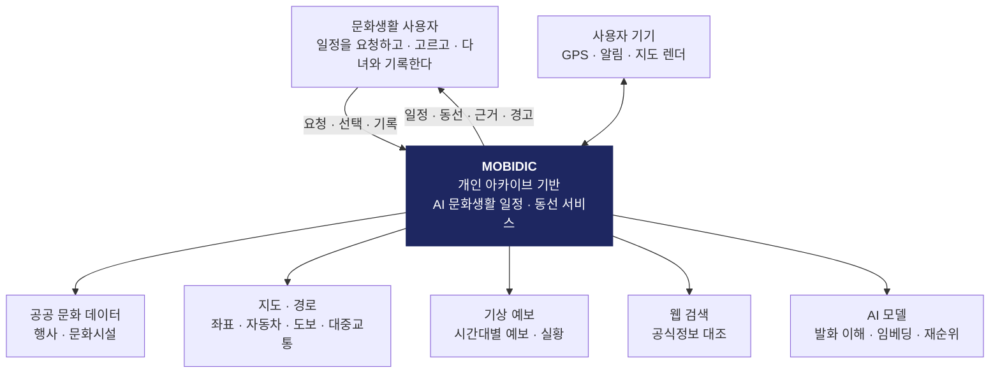
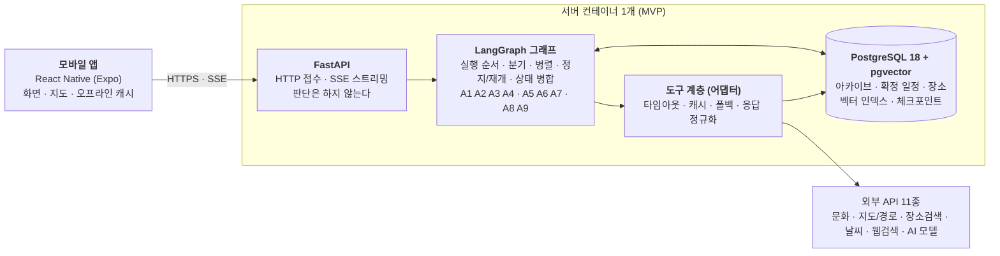
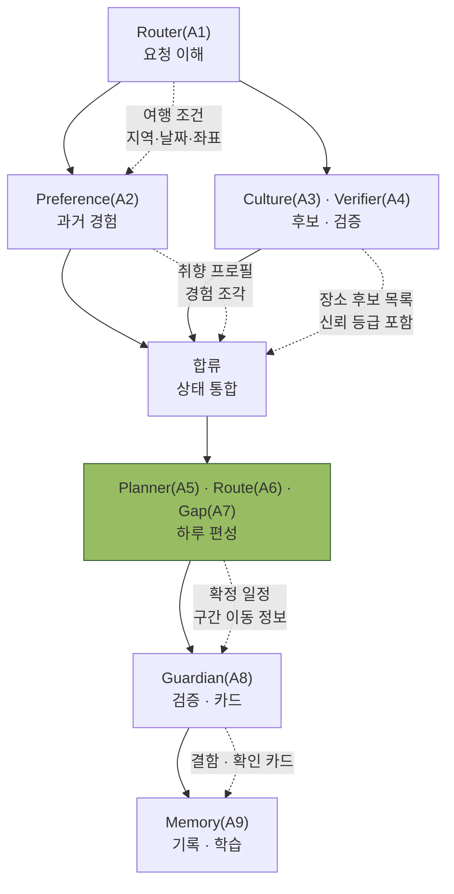
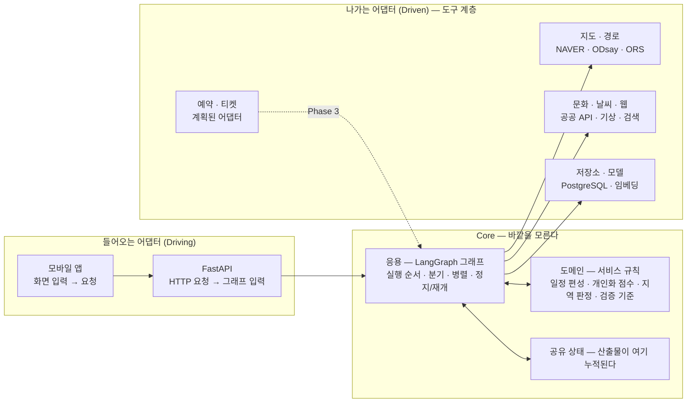

# 문서 3 — 전체 시스템 아키텍처 (C4 L1~L3 · 포트와 어댑터)

> **어디서 실행되고, 무엇에 기대고, 바깥과 어떻게 연결되는가.**
> 역할 정의는 [AGENT_ROLES.md](AGENT_ROLES.md), 협업 순서는 [AGENT_WORKFLOW.md](AGENT_WORKFLOW.md).
> 기준 문서는 [PLANNING.md](PLANNING.md) — 특히 §3.2(데이터 파이프라인)와 §6(서비스 다이어그램).
>
> **작성 원칙 — 소스가 근거다.** 계층 배치와 의존 방향은 `app/` 의 import 를 실제로 훑어 판정했다.
> 지켜지지 않은 것은 §5에 그대로 적는다 — 숨기면 심사에서 가장 먼저 드러난다.

---

## 0. 읽는 축 — 관심사 4계층

Agent도 화면도 어댑터도 이 네 칸 중 하나에 놓인다. 이후 모든 그림이 같은 축을 쓴다.

| 계층 | 무엇인가 | 이 계층의 것 | 기술 |
|---|---|---|---|
| **UI** | 사용자에게 보이고 입력을 받는 것 | 화면 · 지도 렌더링(선 그리기) · 확인 카드 · 오프라인 캐시 | React Native (Expo) |
| **응용** | 무엇을 언제 실행할지 조율하는 것 | Agent 실행 순서 · 조건 분기 · 병렬 · 정지와 재개 · 상태 병합 | LangGraph |
| **도메인** | 이 서비스의 규칙 자체 — **바깥을 모른다** | 일정 편성 규칙 · 개인화 점수 · 지역 판정 · 검증 기준 · 도메인 모델 | 순수 Python |
| **인프라** | 바깥 세계와 닿는 모든 것 | HTTP 접수 · 외부 API 어댑터 · 저장소 · 모델 호출 | FastAPI · `tools/` · PostgreSQL |

---

## 1. C4 — Level 1 · Context

MOBIDIC을 하나의 상자로 두고, **누가 쓰고 무엇에 기대는지**만 본다.

**사용자는 하나이고, 기대는 외부는 다섯 묶음이다.**

| 외부 시스템 | 제공자 | 없으면 | 필수도 |
|---|---|---|:--:|
| 공공 문화 데이터 | KCISA · 공공데이터포털 | 웹검색 + 내장 카탈로그가 대신한다 | 선택 |
| 지도 · 경로 | NCP Maps · ORS · ODsay | 좌표 없으면 **후보 자격 자체가 없다** / 경로는 추정으로 | 좌표는 필수 |
| 기상 예보 | 기상청 API허브 | 악천후 경고 없음 | 권장 |
| 웹 검색 | Tavily → Exa | 검증이 전부 «확인 필요» | 권장 |
| AI 모델 | NVIDIA NIM · OpenAI | 규칙 폴백으로 동작 / **임베딩은 필수** | 임베딩 필수 |

> **다섯 전부에 폴백이 있어 어느 하나가 죽어도 서비스는 축소된 형태로 답한다.**
> 이 원칙이 L2의 «도구 계층»을 만든 이유다.
> **데이터·경로 API는 전부 무료 티어**이며 예외는 채팅 LLM 하나다 — 유료를 섞으면
> 키가 없는 심사·데모 환경에서 그 구간이 통째로 비어 일정이 성립하지 않는다.

---

## 2. C4 — Level 2 · Container

네모 하나가 **따로 실행되거나 따로 배포되는 것**이다.

| 컨테이너 | 책임 | 계층 | 기술 |
|---|---|:--:|---|
| 모바일 앱 | 화면 · 지도 렌더링 · 오프라인 캐시 · 확인 카드 | UI | React Native 0.86 / Expo SDK 57 |
| FastAPI | HTTP 접수 · SSE · 2단계 API — **판단은 하지 않는다** | 인프라 | FastAPI 0.141.1 · 엔드포인트 23개 |
| LangGraph 그래프 | Agent 실행 순서 · 상태 · 정지/재개 | 응용 + 도메인 | LangGraph 1.2.10 · 노드 11 |
| 도구 계층 | 외부 어댑터 — 타임아웃 · 캐시 · 폴백 | 인프라 | `app/tools/` |
| PostgreSQL + pgvector | 사실 · 계획 · 경험 · 벡터 · 체크포인트 | 인프라 | PostgreSQL 18 + pgvector 0.8.5 |

**읽는 법 — FastAPI는 그래프를 부르기만 하고, 그래프는 외부를 직접 부르지 않는다.**
바깥과 닿는 지점이 «도구 계층» 하나로 모여 있어, **제공자를 바꿔도 Agent는 그대로다.**

> **MVP는 컨테이너 하나에 PostgreSQL + API가 함께 있다.** 베이스 이미지가
> `pgvector/pgvector:pg18` 이라 볼륨을 그대로 이어받는다. 한 컨테이너에 프로세스 둘은
> 일반적인 운영 방식이 아니다 — postgres가 죽으면 컨테이너 전체가 내려간다.
> **데모용 선택이고 `docker-compose.yml` 을 남겨 뒀으므로 되돌리기는 쉽다**(§6).

---

## 3. C4 — Level 3 · Component

그래프 안쪽. **위 화살표가 실행 순서, 아래가 오가는 데이터**다.

| 컴포넌트 | 구현 | 계층 |
|---|---|:--:|
| `graph/router/` | 6모듈 — 라우팅 표 · 규칙 파서 · 좌표 확정 | 응용 |
| `subgraphs/archive.py` | facet 팬아웃 · RRF · 리랭크 | 응용 |
| `subgraphs/discovery.py` | 4소스 병렬 · 관문 4개 · 검증 | 응용 |
| `subgraphs/itinerary/` | 9모듈 — 편성 · 이동 · 빈틈 | **도메인** |
| `subgraphs/validation.py` | 검사 6종 · triage · 카드 | 응용 |
| `nodes.py` | 조율 — 합류 · HITL · 확정 · 기록 · 응답 | 응용 |
| `reducers.py` · `state.py` | 공유 State 스키마와 병합 규칙 | 응용 |
| `schemas.py` | 도메인 모델 — **다른 계층을 전혀 참조하지 않는다** | 도메인 |
| `tools/` | 외부 어댑터 12모듈 | 인프라 |
| `memory/` · `db/` | 저장소 접근 · 프로필 집계 | 인프라 + 도메인 |

**공유 State** — 위 모든 산출물이 여기 누적되고, 정지 시 통째로 저장된다.
**A3 · A4 · A6 · A7 만 도구 계층을 통해 바깥에 닿는다.** A1 · A5 · A8 · A9 는 닿지 않는다.

병렬 갈래가 같은 채널에 쓸 때 무엇이 이 상태를 지키는지는
[AGENT_WORKFLOW.md §4.0](AGENT_WORKFLOW.md) 에 있다.

> **그림** — [병렬 실행 시 키 충돌이 나는 이유 · 출력 스키마로 막는 법](diagrams/parallel-key-conflict.svg)

### 3.1 데이터 아키텍처 — 13 테이블 + 체크포인트 3

**사실·계획·경험·벡터를 한 DB에 둔다.** 조인 가능해야 개인화가 성립한다 —
«이 후보가 내가 작년에 갔던 그곳인가»를 물으려면 두 축이 같은 트랜잭션 안에 있어야 한다.

| 축 | 테이블 | 담당 Agent |
|---|---|---|
| 사실 | `places` · `place_snapshots` · `api_cache` | A3 · A4 |
| 계획 | `plans` · `plan_edits` | A5 · A9 |
| 경험 | `visits` · `experience_embeddings` · `taste_profiles` | A2 · A9 |
| 결정 | `hitl_decisions` | A8 · A9 |
| 취향 | `preference_cards` | A2 |
| 수집 | `user_collections` · `user_collection_places` | — |
| 사용자 | `users` | — |
| 체크포인트 | `checkpoints` · `checkpoint_blobs` · `checkpoint_writes` | 그래프 |

- **벡터 인덱스** — HNSW `m=16, ef_construction=64`, cosine. `vector(1024)` 는 `EMBED_DIM=1024` 와 **짝으로 고정**이다. 모델을 바꾸려면 스키마와 기존 임베딩을 함께 재생성해야 한다.
- **개인정보 통제(UR-17)** — `users` 를 참조하는 모든 테이블에 `ON DELETE CASCADE`. 단 `place_snapshots` 는 `SET NULL` — 공식정보 스냅샷은 개인정보가 아니라 사실 기록이므로 다른 사용자의 검증 근거로 남는다.

---

## 4. 포트와 어댑터

**안쪽(도메인·응용)은 바깥을 모른다.** 어댑터가 양쪽을 잇고, **의존은 바깥에서 안으로만** 흐른다.

| | 포트(계약) | 어댑터 | 바꿔도 되는가 |
|---|---|---|---|
| **Driving** | «요청 1건» — `user_id` · `thread_id` · `message` | 모바일 앱 · FastAPI | ✅ 웹·CLI를 붙여도 Core는 그대로 |
| **Driven** | «좌표를 다오» · «경로를 다오» · «검색해 다오» | `tools/maps.py` · `tools/routing.py` · `tools/websearch.py` … | ✅ 제공자 교체가 Agent에 닿지 않는다 |
| **Driven** | «저장하고 읽어 다오» | `db/repo.py` · `memory/` | ◐ 일부 접근이 아직 모이지 않았다 |
| **Driven** | «모델을 불러 다오» | `llm/provider.py` — 역할별 배분 | ✅ `.env` 접두사로 역할별 교체 |

**어댑터가 흡수하는 것** — 타임아웃 · 캐시(지오코딩 24h · 경로 30m~1h · 웹검색 15m) ·
폴백 · 응답 정규화. **Agent는 이 상자들을 직접 부르지 않는다.**

**서버는 지도 공급자를 모른다.** 좌표만 내려주고 선은 앱이 그린다 — 공급자를 바꿔도
서버 계약은 그대로다. 이것이 «지도 기반 동선»(UR-06)이 UI 계층에 남는 이유다.

---

## 5. 지켜진 것과 아직 아닌 것

### 잘 지켜진 것

- **도메인 모델(`schemas.py`)이 다른 계층을 전혀 참조하지 않는다** — `app.` 내부 import 0건.
- **그래프 → 도구는 단방향.**
- **외부 호출이 한 관문(`safe_call`)을 지난다** — 타임아웃·캐시·폴백이 한 곳에 있다.
- **서버는 지도 공급자를 모른다.**
- **경로 제공자 전제를 테스트가 지킨다** — `tests/test_tools.py::test_routing_uses_only_free_providers` 가 `app`·`scripts`·`mobile`·설정 파일까지 훑는다.

### 아직 아닌 것

| 항목 | 지금 | 무엇을 하면 되는가 |
|---|---|---|
| 포트가 **인터페이스로 선언**돼 있지 않다 | 교체는 import를 바꾸는 방식 | `Protocol` 로 포트를 선언하고 어댑터가 구현하게 한다 |
| 도구 계층 한 곳이 응용을 **거꾸로 참조**한다 | `tools/verify.py` 가 `graph.budget.Budget` 을 함수 안에서 import | 예산을 인자로 받는 값 타입으로 내리면 방향이 회복된다 |
| 저장소 접근이 완전히 모이지 않았다 | `db/repo.py` 와 `memory/` 두 곳 | 저장소 포트를 하나로 좁힌다 |

> **→ 지금은 «육각형을 지향하는 계층 분리»에 가깝다.** 육각형 아키텍처를 다 갖췄다고
> 말하지 않는다. 세 항목이 남아 있고, 셋 다 **어디를 고치면 되는지가 정해져 있다.**

---

## 6. 배포 구성 — «모듈 모놀리스»

배포는 하나, 내부는 관심사별로 갈려 있다. 마이크로서비스가 아니고, 한 덩어리 모놀리스도 아니다.

| | 모놀리스 | **모듈 모놀리스 (지금 여기)** | 마이크로서비스 |
|---|---|---|---|
| 배포 | 1개 | **1개** | N개 |
| 내부 경계 | 없음 | **있음** (UI·응용·도메인·인프라) | 프로세스 경계 |
| 대가 | 어디를 고칠지 모름 | **DB가 같은 컨테이너 — 장애가 전체로 번짐** | 운영·관측·배포 비용이 먼저 든다 |

**모놀리스인 근거** — 배포 단위가 하나다(컨테이너 1개에 API·그래프·DB) ·
프로세스 경계가 없다(Agent 호출이 전부 함수 호출) · DB 장애가 곧 전체 장애.

**«모듈»인 근거** — 관심사별 패키지 경계가 있다 · 의존이 단방향이다(역방향 1건 제외) ·
외부 연결이 도구 계층 한 곳으로 모여 있다.

### 전환 조건 — 아래가 참이 될 때 컨테이너를 나눈다

| 조건 | 내용 |
|---|---|
| 동시 사용자 증가 | 한 프로세스로 감당이 안 될 때 API·그래프를 ×N 으로 |
| 장애 격리 필요 | DB가 죽으면 전체가 죽는 지금 구조를 더는 감당할 수 없을 때 |
| 배포 주기 분리 | 앱과 그래프를 따로 배포해야 할 때 |
| **먼저 할 일** | **포트를 인터페이스로 선언** — 나누기 전에 경계를 계약으로 만든다 |

---

## 7. 횡단 관심사

| 관심사 | 어디에 | 규칙 |
|---|---|---|
| **응답 예산** | `graph/budget.py` | 타임아웃이 아니라 비용. `COST_COMPOSE=2.5` 는 항상 예약 — 무엇을 건너뛰든 답변은 나온다 |
| **실패 격리** | `tools/base.py` `safe_call` | 외부 1개가 죽어도 그래프는 안 멈춘다 |
| **설명가능성** | 전 노드 → `evidence[]` | 기능이 아니라 **데이터 계약**이다. 노드는 결과와 함께 반드시 근거를 남긴다 |
| **직렬화 안전성** | `graph/serde.py` | `JsonPlusSerializer(allowed_msgpack_modules=ALLOWED_TYPES)` — 우리 도메인 타입만 허용 |
| **시각 규약** | `schemas.utc_now()` · `weather.today_kst()` | 기록 시각(tz 붙은 UTC)과 벽시계 시각(tz 없는 지역 시각)을 섞지 않는다 |
| **모바일 페이로드** | `NFR-09` | 목록에는 `evidence_ids` 만, 원문은 지연 로드. 캘린더 목록에 `payload` 전문을 실으면 안 된다 |
| **개인정보** | `db/001_schema.sql` | `ON DELETE CASCADE` 전면 · 공유 시 위치·메모 제외 |

---

## 8. 이 문서를 고칠 때

1. **§5 «아직 아닌 것»을 지울 때는 소스를 다시 훑는다.** 이 절이 이 문서의 신뢰를 담보한다 — 지켜지지 않은 것을 지운 문서는 설계서가 아니라 홍보물이다.
2. **엔드포인트를 더하면 `tests/test_docs_contract.py::test_api_surface_is_documented` 가 먼저 깨진다.** `EXPECTED_ROUTES` 와 [FUNCTIONAL_MAP.md §5](FUNCTIONAL_MAP.md)를 같은 커밋에서 고친다 — 순서는 문서가 먼저다.
3. **§6의 «지금 여기»가 움직이면 §2의 컨테이너 그림도 함께 움직인다.**
