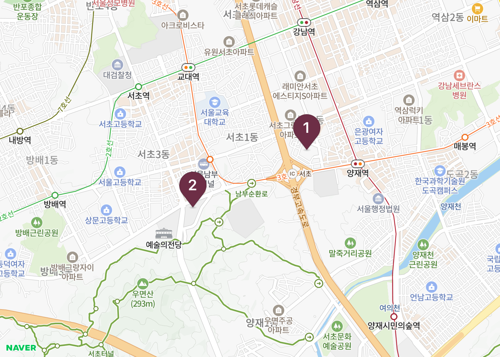
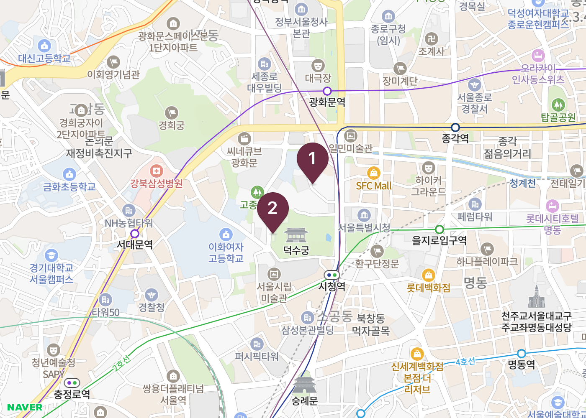
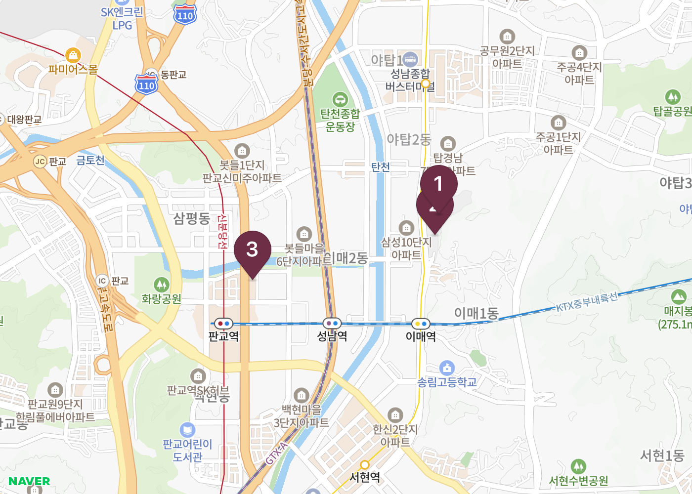
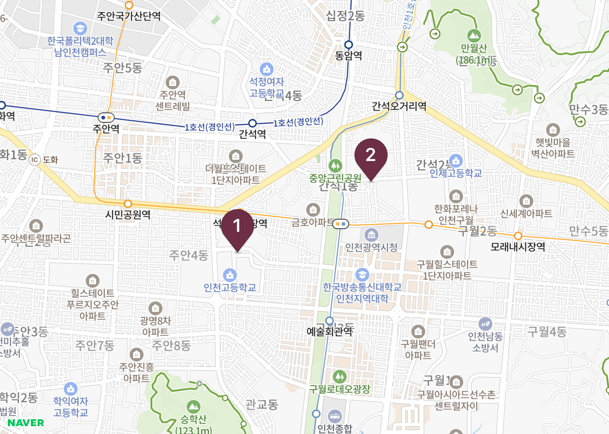
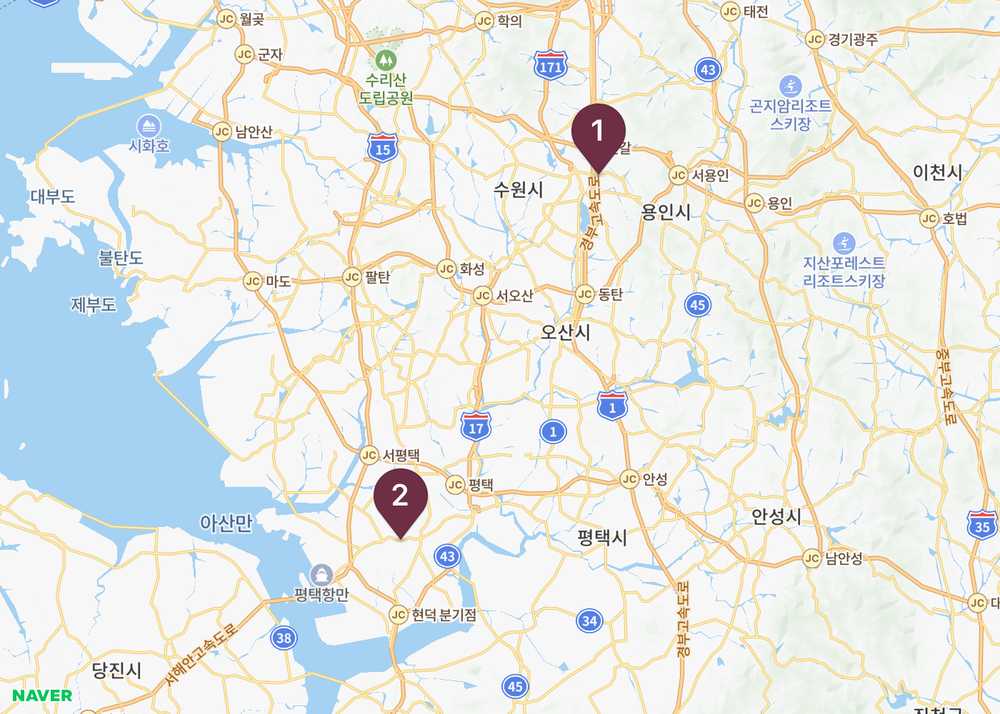
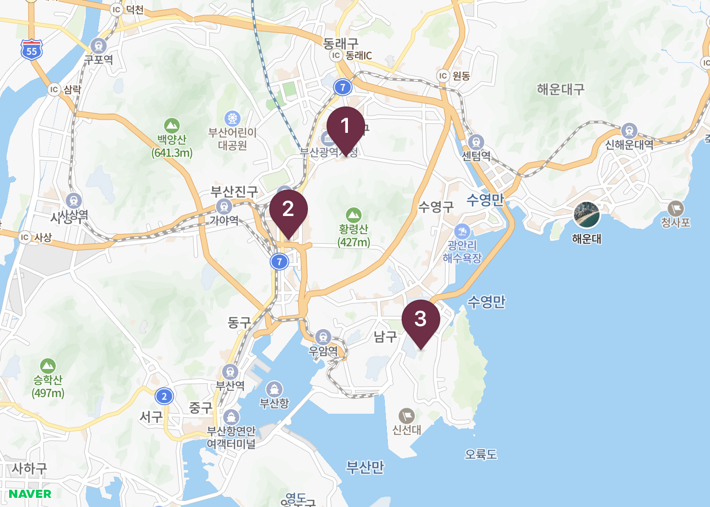
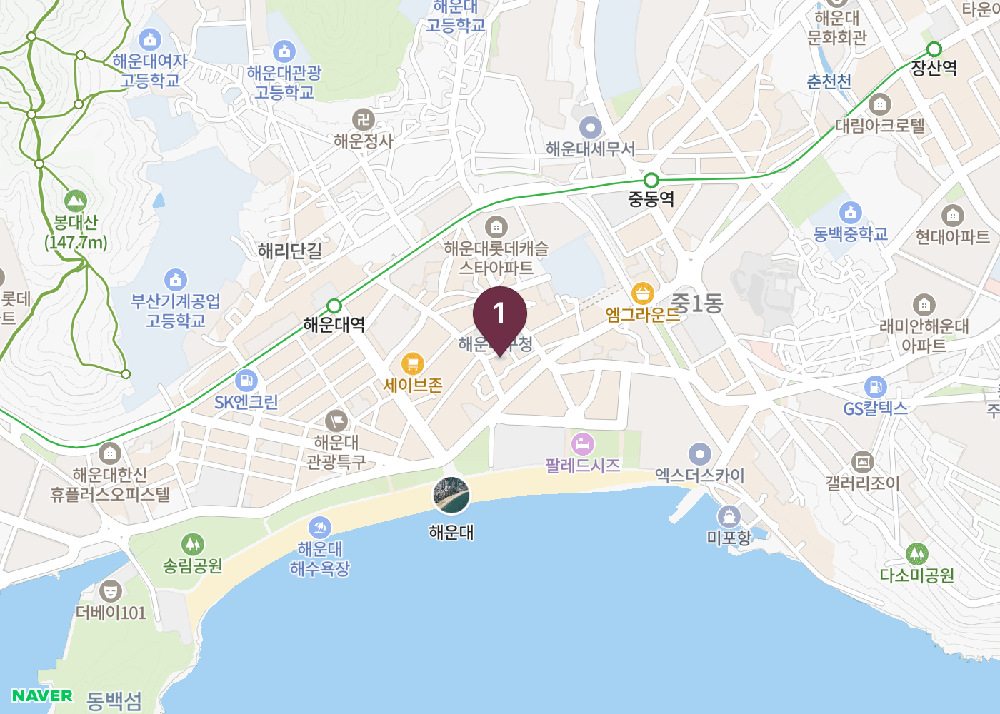

# 테스트 결과 보고서 — 지역별 일정 생성

> 웹(`http://localhost:19006`) + 백엔드(`http://localhost:8000`) 기준.
> **지역을 바꿔 가며 같은 요청을 넣었을 때 그 지역의 장소가 나오는가**를 본다.
>
> 관련 문서 — 기능별 소스 위치는 [FUNCTIONAL_MAP.md](FUNCTIONAL_MAP.md),
> 현재 상태는 [PROGRESS.md](PROGRESS.md), 요구사항은 [REQUIREMENTS.md](REQUIREMENTS.md),
> 기획안 대조는 [PLANNING.md](PLANNING.md).
>
> **검증 보고서는 두 편이다** — 이 문서는 **지역별 일정 생성**, 전 구간 기능 검증은
> [TEST_FUNCTIONAL.md](TEST_FUNCTIONAL.md). 범위가 다르므로 결함 번호(D-**)도 서로 독립이다.
>
> **§7 은 두 갈래다** — 7.1 은 이 지역별 검증에서 나온 UR-18~27,
> 7.2 는 **기획안 대조(2026-08-16)** 에서 나온 UR-28~39 다. 근거가 다르므로 나눠 적는다.

**실행일** 2026-08-13 · **환경** Windows 11 · Docker 컨테이너 1개(PostgreSQL 18.4 + FastAPI) ·
Expo SDK 57 웹 빌드

---

## 1. 요약

| 항목 | 결과 |
|---|:--:|
| 자동 테스트 (pytest) | ✅ **128 passed, 1 skipped** |
| 정적 검사 (ruff) | ✅ **All checks passed** |
| 클라이언트 타입 (tsc) | ✅ 통과 |
| 외부 API 연동 | ✅ **10 / 10** |
| 지역별 시나리오 | ✅ **7 / 7 응답** |
| 2단계 경로 실측 | ✅ 전 지역 좌표 수신 |
| **지역 정확도** | ⚠️ **5 / 7** — 2건에서 다른 지역 장소 유입 |
| 웹 콘솔 에러 | ✅ **0건** |

**한 줄 결론 —** 수도권·부산 등 **문화시설이 밀집한 지역은 정확**하다.
**광역도(충청남도)와 경기 남부는 인접 지역 장소가 섞인다.**

---

## 2. 테스트 방법

각 지역마다 `POST /chat/sync` → `POST /threads/{id}/routes` 를 순서대로 호출했다.
웹 앱이 실제로 부르는 것과 같은 경로다.

**판정 기준** — 이름이 아니라 **좌표**로 본다. `대구 메트로 갤러리`처럼 이름에
지역이 붙은 것만 세면, 이름에 지역이 없는 장소는 놓친다. 각 장소의 좌표를 요청
지역 중심과 대조해 허용 반경 안인지 계산했다.

| 지역 | 기준 좌표 | 허용 반경 |
|---|---|---:|
| 강남구 | 37.4979, 127.0276 | 15km |
| 서울시 | 37.5665, 126.9780 | 30km |
| 성남시 | 37.4200, 127.1265 | 20km |
| 인천시 | 37.4563, 126.7052 | 30km |
| 충청남도 | 36.6588, 126.6728 (홍성) | 60km |
| 부산시 | 35.1796, 129.0756 | 30km |
| 해운대 | 35.1587, 129.1604 | 15km |

> **지도 이미지에 대하여.** 이 환경에서는 브라우저 패널이 표시되지 않아 앱 화면을
> 직접 캡처할 수 없었다. 대신 **응답에 담긴 실제 좌표와 2단계에서 받은 경로
> 선형(`travel_path`)을 네이버 정적 지도 API로 렌더링**했다. 앱 지도와 같은
> 데이터를 같은 지도 위에 그린 것이므로 위치 검증에는 동등하다. 다만 앱의 UI
> (타임라인·확인 카드·수단별 선 스타일)는 담기지 않는다.

---

## 3. 지역별 결과

| ID | 지역 | 시간 | 장소 | 검증됨 | 경로좌표 | 지역 정확도 |
|---|---|---:|---:|---:|---:|:--:|
| R-01 | 강남구 | 9.3s | 2 | 2 | 109 | ✅ 2/2 |
| R-02 | 서울시 | 17.7s | 2 | 2 | 52 | ✅ 2/2 |
| R-03 | 성남시 | 15.1s | 3 | 0 | 164 | ✅ 3/3 |
| R-04 | 인천시 | 12.1s | 2 | 2 | 178 | ✅ 2/2 |
| R-05 | 충청남도 | 14.8s | 2 | 1 | 120 | ❌ **0/2** |
| R-06 | 부산시 | 9.6s | 3 | 3 | 260 | ✅ 3/3 |
| R-07 | 해운대 | 11.2s | 1 | 1 | 27 | ✅ 1/1 |

### R-01 강남구 — ✅

`한전갤러리` · `예술의전당 한가람미술관`
둘 다 강남·서초 권역. 검증 2/2.



### R-02 서울시 — ✅

`아트조선스페이스` · `국립현대미술관 덕수궁`
도심 권역. 광역 요청인데도 시내로 모였다.



### R-03 성남시 — ✅

`성남아트센터` · `성남큐브미술관` · `카츠쇼신 판교아브뉴프랑점`
**성남 시설 두 곳을 정확히 집었고**, 식사 자리도 판교로 붙였다.
다만 검증은 0/3 — 이 회차에 공식정보 대조가 예산에서 밀렸다.



> 같은 요청을 다른 회차에 돌렸을 때는 `평택서부문화예술회관`(51.2km)이
> 섞였다. **회차에 따라 결과가 달라진다**(§4 D-02).

### R-04 인천시 — ✅

`은하수미술관` · `골목 박물관`



### R-05 충청남도 — ❌ **지역 불일치**

`백남준아트센터`(용인, 78.2km) · `평택서부문화예술회관`(평택)

**둘 다 경기도다.** 지도를 보면 마커가 수원·용인과 평택에 찍혀 있고,
충청남도 경계 안에는 하나도 없다.



다른 회차에서는 `디아트엘` · `충청남도 문화예술회관` · `화신각` 이 나왔는데,
그중 `충청남도 문화예술회관`은 실제로 충남 소재이므로 **회차에 따라 맞기도 한다.**

### R-06 부산시 — ✅

`초록나무미술관` · `포스코더샵아트센터` · `부산 미르 갤러리`
부산 시내에 고르게 분포. 검증 3/3, 경로 좌표 260점으로 가장 촘촘하다.



### R-07 해운대 — ✅

`고은 깁슨 사진미술관` — 해운대 권역 정확.
다만 **1곳만 나왔다**(§4 D-03).



---

## 4. 발견된 결함

| ID | 심각도 | 내용 |
|---|:--:|---|
| **D-01** | 높음 | 광역도·경기 남부에서 **인접 지역 장소가 섞인다** (R-05) — ◐ 2026-08-17 UR-18 로 시·도 판정 추가 |
| **D-02** | 중 | 같은 요청인데 **회차마다 결과가 다르다** |
| **D-03** | 중 | 장소가 **1~3곳으로 적다** (하루 일정으로 부족) |
| **D-04** | 중 | 응답 시간이 목표 15초를 넘는 회차가 있다 (최대 17.7초) |
| **D-05** | 하 | 회차에 따라 공식정보 검증이 통째로 밀린다 (R-03 검증 0/3) |
| **D-06** | — | 모바일 Expo Go 가 SDK 57 미지원 |

### D-01 — 광역도에서 지역이 어긋난다

**증상** — "충청남도에서 일정"을 요청했는데 용인·평택 장소만 나왔다.

**원인 추정 두 가지.**

1. **거리 상한이 느슨하다.** `discovery` 의 `MAX_ANCHOR_KM = 60` 은 수도권을 한
   덩어리로 묶으려고 정한 값이다. 충남 요청에서 기준점이 서울·경기 쪽에 잡히면
   60km 안에 경기 남부가 통째로 들어온다.
2. **카탈로그에 지방 데이터가 얇다.** `places` 2,092곳 중 **실제 장소는 92곳**이고
   나머지는 생성된 더미다. 지방은 공공 API 결과에 의존하는데, 그마저 좌표 게이트를
   통과하지 못하면 인접 지역이 채운다.

**근거** — 수도권(R-01·02·03)과 부산(R-06·07)은 전부 정확하다. 실패한 건
**문화시설 밀도가 낮은 광역도**뿐이다.

**조치 (2026-08-17 · UR-18)** — 원인 1은 닫혔다. `app/tools/region.py` 가 지오코딩
응답·주소에서 시·도와 시군구를 읽고, `discovery.normalize` 가 **요청한 시·도가
아니라고 확인된** 후보를 버린다. 거리 상한은 그대로 두되 역할이 바뀌었다 —
행정구역을 알 수 없는 후보(주소를 안 주는 공공 API 행사)를 받는 **보조 수단**이다.
원인 2(카탈로그 지방 커버리지)는 그대로이므로 **D-01 은 절반만 닫혔다** — 이제
'다른 지역이 섞이는' 문제가 아니라 '그 지역에 후보가 적은' 문제(D-03)로 옮겨 간다.

### D-02 — 같은 요청, 다른 결과

R-03 성남시를 두 번 돌렸더니 한 번은 정확했고(`성남아트센터`·`성남큐브미술관`),
한 번은 `평택서부문화예술회관`(51.2km)이 섞였다. R-05도 회차에 따라 충남 시설이
나오기도 했다.

외부 API 응답이 회차마다 달라지고(쿼터·순서·타임아웃), 예산이 부족하면 단계가
축소되기 때문이다. **설계대로 동작하는 것이지만, 사용자에게는 "될 때도 있고 안
될 때도 있는" 서비스로 보인다.**

### D-03 — 장소 수가 적다

```
강남구 2곳 · 서울시 2곳 · 성남시 3곳 · 인천시 2곳
충청남도 2곳 · 부산시 3곳 · 해운대 1곳
```

하루 일정으로는 부족하다. 시각·이동수단이 확정된다는 강점이 **채울 내용이 없어**
드러나지 않는다. D-01과 뿌리가 같다 — 후보 풀이 얇다.

### D-04 — 응답 시간 편차

```
최소 9.3초 (강남구)  ~  최대 17.7초 (서울시)
7건 중 15초 초과 2건
```

내부 처리는 빠르다. 편차는 외부 API 대기에서 나온다. 예산제가 단계를 줄여
답변은 항상 나오지만, 목표 15초를 못 지키는 회차가 있다.

### D-05 — 검증이 밀린다

R-03에서 3곳 모두 `verify_status` 가 `verified` 가 아니었다. 1단계 예산이 부족해
공식정보 대조가 2단계로 넘어갔고, 그 회차에는 2단계에서도 다 처리하지 못했다.

### D-06 — 모바일 Expo Go 비호환

```
ERROR  Project is incompatible with this version of Expo Go
```

프로젝트가 `expo 57.0.11 / react-native 0.86.2` 로 최신이라 Play 스토어의
Expo Go 가 SDK 57을 지원하지 않는다. **네트워크·방화벽·포트는 모두 해결된
상태다** — 폰이 PC에 도달했기 때문에 이 에러를 받은 것이다.

> 함께 확인한 것: Expo 기본 포트 8081이 Windows 예약 구간(8075~8174)이라
> 자동으로 다른 포트(8175)로 넘어간다. 정상 동작이다.

---

## 5. 이번 테스트에서 확인된 정상 동작

결함만 적으면 무엇이 되는지 알 수 없으므로 함께 남긴다.

| 기능 | 확인 내용 |
|---|---|
| **지역 인식** | 7개 지역 모두 요청한 도시로 이동. 서울 요청에 부산이 나오는 식의 광역 오류는 없다 |
| **2단계 경로 실측** | 전 지역에서 좌표 수신 (27~260점). 지도에 직선이 아닌 실제 노선이 그려진다 |
| **식사 자리 선점** | R-03에서 `카츠쇼신 판교아브뉴프랑점` 이 동선 안에 배치됨 |
| **공식정보 검증** | R-01·02·04·06·07 에서 전 장소 `verified` |
| **HITL** | 확인 카드 생성 → `interrupt()` 정지 → 선택 반영 → 재개 정상 |
| **조건 칩** | 확인 카드가 떠도 해석된 조건이 함께 내려온다 (직전 수정) |
| **장애 격리** | 외부 API 실패·429 가 있어도 그래프가 멈추지 않고 답을 낸다 |

---

## 6. 미구현 기능

문서에 정의돼 있으나 코드에 없는 항목. **심사에서 가장 먼저 드러나는 부분이라
숨기지 않고 명시한다.**

| ID | 기능 | 상태 | 실제 상황 |
|---|---|:--:|---|
| **UR-01** | 개인 취향 등록(카드) | ✅ | `POST /preferences/cards` → `profile.apply_preference_cards` → `taste-cards.tsx` (2026-08-17). 콜드 스타트에서 `personal_score` 가 0.5 고정을 벗어난다 |
| **UR-09** | 일정 직접 수정 | ✅ | 재계획·수단 변경·선택 반영에 더해 **확정 카드 선택과 일정 diff 를 `plan_edits` 에 기록**하고 `rebuild_profile()` 이 되읽는다 (2026-08-17) |
| **UR-28** | **캘린더로 일정 확인** ★핵심 | ⬜ 미구현 | `plans(user_id, plan_date, payload)` 에 **저장은 되고 있다**(`nodes.persist`). 기간 조회 엔드포인트와 캘린더 탭이 없다 |
| **UR-40** | 과거 불편의 선제 경고 | ⬜ 미구현 | `Issue.kind="past_friction"` 은 스키마·카드 옵션에 있으나 **만드는 노드가 없다.** 기획안 2.1-②가 도달 불가능 |
| **FR-25** | 카드 스와이프 온보딩 | ✅ | UR-01과 같은 사안 |
| **FR-26** | 영화 상영 시간표 | ⬜ | 상영 시간표 API가 유료라 보류 |
| **FR-27·28** | 캘린더 조회 API · 화면 | ⬜ | UR-28과 같은 사안 |
| **FR-29** | 과거 불편 → 경고 승격 | ⬜ | UR-40과 같은 사안 |

> **문서 숫자 정정 (2026-08-16).** 소스를 다시 세어 보니 메인 그래프는 **11 노드**
> (서브그래프 4 + 조율 7), 라우트는 **7종**이다. 여러 문서가 12노드·5서브그래프·8라우트로
> 적고 있었다(`report` 서브그래프와 `taste_report` 라우트가 삭제된 뒤 문서가 안 따라옴).
> `tests/test_docs_contract.py` 는 **집합**만 비교하므로 이 숫자 문장은 잡지 못한다 —
> 계약 테스트가 무엇을 지키고 무엇을 안 지키는지 알아 두는 편이 낫다.

### 왜 이것이 중요한가

`REQUIREMENTS.md §0` 은 일반 추천 서비스와의 차별점을 이렇게 정의한다:

> 개인화 근거 = **방문 기록 + 일정 수정 행동**(거절 기록 포함)

**그 절반(수정 행동)이 저장되지 않았다 — 2026-08-17 에 이었다.**
`extract_edit_signals()` / `apply_edit_signals()` 는 있었지만 입력이 영속화되지 않아
세션을 넘기면 사라졌고, 재집계는 방문 기록만 봤기 때문에 방문이 하나 들어오는 순간
프로필에 남아 있던 반영분까지 지워졌다. 지금은 `persist → repo.save_plan_edits()` 가
남기고 `profile.rebuild_profile()` 이 되읽는다. 회귀 테스트는 `tests/test_edits.py`.

---

## 7. 추가 제안 기능 (신규 UR)

### 7.1 지역별 검증에서 나온 것 (UR-18 ~ UR-27)

이번 지역별 검증에서 드러난 것을 근거로 제안한다. 번호는 기존 UR-17 다음부터다.

| ID | 기능명 | 근거 | 우선순위 |
|---|---|---|:--:|
| ~~**UR-18**~~ | **행정구역 경계 기반 필터** | D-01. 반경(km)이 아니라 시·도 경계로 판정한다. 광역도는 반경으로 못 잡는다 | ✅ **2026-08-17** |
| **UR-19** | **장소 데이터 자동 보강** | D-01·D-03. 검증된 장소를 `places` 에 누적해 지방 커버리지를 늘린다 | **높음** |
| **UR-20** | **결과 부족 시 명시** | D-03. "이 지역에서 3곳만 찾았습니다" 를 알리고 범위 확대를 제안한다. 조용히 2곳만 주면 고장으로 보인다 | **높음** |
| **UR-21** | 응답 시간 가시화 | D-04. 무엇을 기다리는지 단계별로 보여 체감 지연을 줄인다 | 중간 |
| **UR-22** | 일정 저장·공유 링크 | 만든 일정을 다시 열거나 동행자에게 보낼 수단이 없다 | 중간 |
| **UR-23** | 실행 후 피드백 수집 | UR-10의 입력 경로가 현재 수동뿐이다 | 중간 |
| **UR-24** | 예산(비용) 조건 | 입장료·식비 상한. `travel_fare` 는 이미 있다 | 중간 |
| **UR-25** | 동행자 유형별 일정 | 아이 동반·부모님·데이트에 따라 체류·장소가 달라져야 한다 | 중간 |
| **UR-26** | 오프라인 열람 | 현장에서 네트워크가 끊겨도 확정 일정과 지도를 봐야 한다 | 낮음 |
| **UR-27** | 대안 일정 비교 | 2~3개 안을 나란히 보여주고 고르게 한다 | 낮음 |

### 우선순위 근거

**UR-18·19·20이 높은 이유는 셋 다 이번 테스트의 실패를 직접 겨냥하기 때문이다.**

- **UR-18** — 거리 상한은 수도권을 묶기 위한 근사치다. 충남처럼 넓고 중심이 없는
  광역도에서는 반경 자체가 맞지 않는다. 행정구역 코드로 판정하면 R-05가 해결된다.
  **2026-08-17 완료** — `app/tools/region.py` · `discovery.normalize`. 회귀는
  `tests/test_region.py`. 「서초구」 요청에 판교(경기 성남시)가 남던 것이 이것이다.
- **UR-19** — 지방 커버리지가 얇은 것이 D-01·D-03의 공통 뿌리다. 검증을 통과한
  장소를 저장만 해도 쓸수록 좋아진다. `link_place_ids()` 가 이미 매칭 로직을 갖고 있다.
- **UR-20** — 2곳짜리 일정을 아무 말 없이 주는 것이 가장 나쁘다. 적게 찾았다는
  사실 자체를 알리면 사용자가 다음 행동을 정할 수 있다. 구현 비용은 가장 작다.

### 7.2 기획안 대조에서 나온 것 (UR-28 ~ UR-39)

`서비스 기획안 모비딕_남경.pdf` 를 화면 시안까지 대조한 결과다. 원문 정리와 항목별
근거는 [PLANNING.md §7](PLANNING.md), 상태를 포함한 전량 목록은
[REQUIREMENTS.md §3.5](REQUIREMENTS.md).

| ID | 기능명 | 기획안 근거 | 지금 상태 | 우선순위 |
|---|---|---|:--:|:--:|
| **UR-28** | **캘린더로 일정 확인** ★핵심 | 4.3 선순환의 «다시 열기» | ⬜ | **최상** |
| **UR-40** | 과거 불편의 선제 경고 복원 | 2.1-② 선제적 알림과 대안 | ⬜ | **높음** |
| **UR-29** | 남은 기간 배지 · «오늘 열려요» 필터 | 2.4-① 통합 목록 | ⬜ | 중간 |
| **UR-30** | 저장 목록에서 일정 만들기 | 2.4-② 결합 생성 | ⬜ | 중간 |
| **UR-31** | 3지 반응(기대돼요/가봤어요/관심 없어요) | 2.4-③ 발견의 접점 | ✅ | — |
| **UR-32** | 구조화 기록 입력(태그·사진·재방문 의사) | 2.1-① · 4.1 자산이 되는 조건 | ◐ | **높음** |
| **UR-33** | 근거 3색 규약 · 확인 시각 노출 | 3.1 색 구분 | ◐ | 중간 |
| **UR-34** | «추천에 적용된 규칙» 칩 · 끄기 | 2.3-③ | ⬜ | 낮음 |
| **UR-35** | 파생 제약 자동 산출(도보·환승 상한) | 3.2 파생 제약 | ◐ | 중간 |
| **UR-36** | 현장 진행 표시 · 조기 종료 감지 | 2.5-③ 현장 대응 | ◐ | 중간 |
| **UR-37** | 하루 이동 요약 · 정렬 선택 · 편의시설 | 2.2-② · 2.5-① | ⬜ | 낮음 |
| **UR-38** | 뱃지 · 맞춤 미션 | 4.3 «05 분석 → 01 탐색» | ⬜ | 낮음 |
| **UR-39** | 예약·티켓 연결 | 5.2 비즈니스 측면 | ⬜ | 낮음(Phase 3) |

#### 우선순위 근거

**UR-28 이 최상인 이유는 «없는 것이 화면 하나»이기 때문이다.** 일정은 이미
`plans.plan_date` 에 저장되고 있고 날짜로 한 건을 꺼내는 함수도 있다. 새 테이블도
새 외부 API도 필요 없다. 반대로 이것이 없으면 UR-32(기록)·UR-38(뱃지)의 진입점이
함께 막힌다 — 기획안 4.3이 «04 기록이 비면 05 분석은 빈 화면»이라고 못 박은 그 상태다.

**UR-40 은 «부품이 다 있는데 조립이 없는» 경우다.** 소비자(카드·선택지·스키마)는
남아 있고 생산자만 제거돼, 기획안의 대표 화면이 코드상 도달 불가능하다. 다만 검증
종류가 5→6으로 늘어 계약 테스트와 문서 두 곳을 함께 고쳐야 하므로 UR-28보다 비싸다.

**UR-32 가 높은 이유는 학습의 입구이기 때문이다.** 기록이 얇으면 UR-40을 복원해도
경고로 승격할 재료가 없다. «별점 하나만으로도 남길 수 있게»와 «일정 종료 시 자동으로
뜨게»가 핵심이고, 태그 선택지는 `visits.friction` 이 이미 배열로 받고 있다.

---

## 8. 개선 방향

### 8.1 즉시 (1시간 이내)

| 대상 | 조치 |
|---|---|
| UR-20 | 응답에 `found_count` 와 부족 사유를 실어 화면에 표시 |
| D-05 | 2단계 `/verify` 가 미처리 장소를 다음 호출에서 이어받도록 |

### 8.2 단기 (반나절)

| 대상 | 조치 |
|---|---|
| ~~UR-18~~ | ✅ 2026-08-17 — 지오코딩 응답(`addressElements`)·주소에서 시·도를 읽어 `GeoPoint.sido/sigungu` 에 싣고, `discovery.normalize` 가 다른 시·도를 제외한다. 반경은 보조 수단으로 남았다 |
| ~~UR-09~~ | ✅ 2026-08-17 — `persist` 가 확정 카드 선택·일정 diff 를 `plan_edits` 에 남기고 `rebuild_profile()` 이 읽는다 |
| D-04 | `discovery` 외부 호출에 예산 기반 조기 종료를 더 공격적으로 적용 |

### 8.3 중기 (수일)

| 대상 | 조치 |
|---|---|
| **UR-28** | `repo.list_plans(user_id, frm, to)` → `GET /plans/{user_id}` · `GET /plans/{plan_id}` → `(tabs)/calendar.tsx`. Timeline·NaverMap 재사용. 목록에 `payload` 전문 금지 |
| **UR-40** | `validation.check_friction` 추가(검증 5→6종). `archive_hits` 의 friction 태그가 이번 일정 항목과 겹치면 `Issue(kind="past_friction")`. 문서·계약 테스트 동시 수정 |
| **UR-32** | 일정 종료 시 기록 화면 자동 노출 + 태그 선택지·사진·재방문 의사 |
| **UR-19** | `verify_status='verified'` 후보를 `places` 에 upsert |
| D-01·D-03 | `scripts/generate_catalog.py` 가 실제 공공 데이터를 지방까지 받아오도록 확장 |
| ~~UR-01~~ | **완료 2026-08-17** — `POST /preferences/cards` + `taste-cards.tsx` |
| D-06 | 개발 빌드(`eas build --profile development`) 또는 SDK 다운그레이드 결정 |

### 8.4 구조 (선택)

- **DB 분리** — 컨테이너 하나에 PostgreSQL + API가 있다. postgres가 죽으면
  컨테이너 전체가 내려간다. `docker-compose.yml` 을 남겨 뒀으므로 되돌리기는 쉽다.
- **노출된 키 재발급** — 개발 중 채팅에 붙여넣은 키가 있다
  (data.go.kr · OpenAI · KCISA · NVIDIA).

---

## 9. 재현 방법

```bat
:: 백엔드
cd /d C:\Users\31\Documents\CulturePilot_AI\culturemate
백엔드실행.bat

:: 자동 테스트
docker run --rm -v "%CD%\tests:/srv/tests" -v "%CD%\docs:/srv/docs" ^
  -v "%CD%\app:/srv/app" -v "%CD%\scripts:/srv/scripts" ^
  -v "%CD%\pyproject.toml:/srv/pyproject.toml" -w /srv ^
  --entrypoint pytest culturemate-api -q

:: 정적 검사 — pyproject.toml 을 반드시 붙인다 (아래 주의 참고)
docker run --rm -v "%CD%\app:/srv/app" -v "%CD%\scripts:/srv/scripts" ^
  -v "%CD%\tests:/srv/tests" -v "%CD%\pyproject.toml:/srv/pyproject.toml" -w /srv ^
  --entrypoint ruff culturemate-api check app scripts tests

:: 외부 API
curl "http://localhost:8000/diagnostics?probe=true"

:: 웹 앱
cd mobile
npm start
```

지역별 시나리오는 `POST /chat/sync` 에 아래 문장을 넣어 재현한다.

```
강남구에서 문화공연 일정 만들어줘
서울시에서 문화공연 일정 만들어줘
성남시에서 문화공연 일정 만들어줘
인천시에서 일정 만들어줘
충청남도에서 일정 만들어줘
부산시에서 일정 만들어줘
해운대에서 일정 만들어줘
```

> ⚠️ **`docker exec culturemate ruff check app scripts` 는 쓰지 않는다** (2026-08-16 확인).
> `Dockerfile` 이 `pyproject.toml` 을 이미지에 복사하지 않아, 컨테이너 안에서 ruff 를 그냥
> 돌리면 **프로젝트 룰셋(`select = ["E","F","I","UP","B","SIM","RUF007"]`)이 아니라 ruff
> 기본값**으로 검사한다. 그러면 `EXE002`·`BLE001`·`TRY401`·`DTZ011` 같은, 이 저장소가
> 의도적으로 켜지 않은 규칙이 96건 쏟아진다. **코드가 더러운 게 아니라 설정이 없는 것이다.**
> 설정을 붙여 돌리면 `All checks passed!` 가 나온다.

시드 데이터가 없으면 개인화가 동작하지 않는다:

```bat
docker exec culturemate python scripts/seed_demo.py
```
